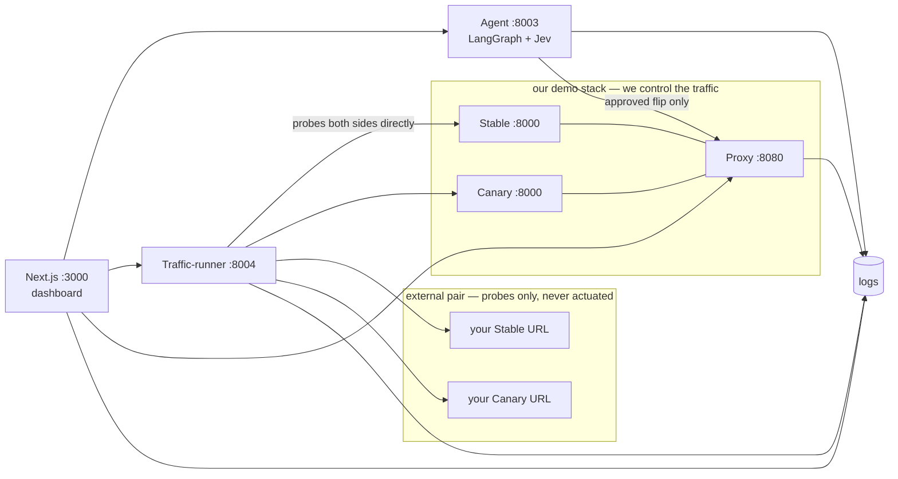

# GuardRail

**Canary deployment verification with a governance-gated traffic flip.**

GuardRail answers one question — *is it safe to send traffic to the new version?* — and then refuses to act on its own answer. It fires identical probes at a Stable and a Canary version, pairs each response with its counterpart, escalates on evidence rather than aggregates, and gates the one promotion mechanism behind a human click that is written to an append-only audit trail.

It also works on **your** API. Connect a Stable/Canary URL pair with an OpenAPI spec and it generates the probe cases, runs them, and advises — without ever touching your traffic.

*Built for the IBM Bob 2.0 hackathon.*

[Quick start](#quick-start) • [How it works](#how-it-works) • [The Decision](#the-decision) • [Bring your own API](#bring-your-own-api) • [Security](#security) • [Configuration](#configuration) • [Tests](#tests) • [Docs](#docs)

---

## The problem

Canary deployments fail in ways that aggregate metrics hide. A single shared failure can mask a canary-only one on the same path. An endpoint can 500 on 1 of 12 probes and look "mostly green" next to a stable 422. A latency regression can be real and get attributed to noise. And the tooling that is supposed to tell you usually answers with a chart, not a decision.

GuardRail's position: **the unit of analysis is the request, not the endpoint.** The same `(method, path, body)` is fired at both versions, so "500 here, 422 there" is directly observable evidence. Everything else follows from joining those pairs.

## Quick start

```bash
git clone https://github.com/msaad53407/ibm-bob-2.0-hackathon.git
cd ibm-bob-2.0-hackathon

cp .env.example .env          # fill in SUPABASE_URL, SUPABASE_SERVICE_KEY,
                              # SUPABASE_ANON_KEY — see .env.example for the rest
openssl rand -hex 32          # → ADMIN_TOKEN in .env
supabase db push              # migrations 0001..0008
docker compose up --build
```

Then allowlist yourself and open the dashboard:

```sql
insert into admins (email) values ('you@example.com');
```

```
http://localhost:3000  →  /login  →  sign in  →  Verification  →  Run traffic  →  Proposals  →  Run Decision
```

> [!TIP]
> Only port `3000` is published. Every other service is `expose`-only on the container network, so the browser reaches them through same-origin Next.js route handlers that inject the service token server-side. To poke an internal service from your shell, use `docker compose exec agent python3 -c "..."`.

> [!NOTE]
> Two bugs are planted in the Canary on purpose, so the demo has something to find: `POST /checkout` with a missing `item_id` returns 500 on Canary and a correct 400 on Stable, and `GET /search` sleeps an extra 800 ms on Canary.

## How it works



Six services, one promotion mechanism.

| Service | Port | Role |
|---|---|---|
| `stable` / `canary` | 8000 | One `api-demo` image, two roles, selected by `BUG_PROFILE` |
| `proxy` | 8080 | Routes live traffic; `GET/POST /admin/route` is the **only** flip in the system |
| `traffic-runner` | 8004 | Fires identical probes at both versions directly — never through the proxy, so a flip can't confound the comparison |
| `agent` | 8003 | LangGraph workflow: fetch → rules → (Jev) → merge → propose, then a gated execute |
| `web` | 3000 | Dashboard, login, and the approval checkpoint |

The Traffic-runner bypasses the proxy on purpose: if it went through the router, a flip mid-run would make Stable and Canary incomparable.

### The agent workflow

The Decision runs as a [LangGraph](https://langchain-ai.github.io/langgraph/) graph (`workers/agent/workflow/`) with one conditional edge:

```
fetch → rules → [assess] → merge → propose → END
              │
              └── assesses only when a Jev key is present and there are rows to judge
```

- **rules** — the deterministic guardrail over paired probes. Always runs.
- **assess** — one call to [Jev](https://www.typesafe.ai) (TypeSafe System One), a decision model rather than a chat LLM: it takes a state string plus typed questions and returns calibrated answers. Skipped entirely without a key.
- **merge** — escalates if **either** source fires, and says so explicitly when they disagree. The human gate stays final either way.
- **propose** — builds and persists the ranked set.

> [!NOTE]
> There is deliberately no checkpointer. Runs are stateless and the human approval gate lives in the FastAPI layer (a saved proposal ID must be approved before a flip), not in a graph interrupt. Stateful interrupts plus a Postgres checkpointer is the documented next step if runs ever need to pause mid-graph.

Both optional AI integrations degrade rather than fail. No `TYPESAFE_API_KEY` means rules-only, labelled `jev: unavailable (rules only)`. No `OPENROUTER_API_KEY` means deterministic cases only. Neither can produce a wrong answer — only fewer answers.

## The Decision

Rows pair by `(case_method, path, case_label)` — the four `case_*` columns the Traffic-runner stamps on every row. Each pair is classified:

| Kind | Meaning | Escalates? |
|---|---|---|
| `canary_error` | same request, canary 5xx, stable not | **yes** |
| `latency_regress` | same request, canary p95 > stable p95 × factor | **yes** |
| `status_divergence` | same request, different status, neither is 5xx | no |
| `shared_error` | 5xx on **both** sides | no — pre-existing, still reported |
| `stable_error` | 5xx on stable only | no — not a canary regression |
| `ok` | same status class, comparable latency | no |

Bucketing per request is what makes a shared failure structurally incapable of masking a canary-only one. It is a real bug this replaced, and `TestMaskingRegression` replays the exact production data that exposed it: twelve canary-only 500s on `POST /todos` were being silenced by one 500 that *both* sides returned on `GET /todos?limit=<overflow>`, because both fell under the same `/todos` path prefix.

Criticality (`critical` for mutating methods, `high` for reads) scales severity — it no longer decides which checks run. A 5xx on a read escalates too.

### Proposals

Proposals are derived from the findings, ranked worst-first:

| Field | Source |
|---|---|
| `action` | the finding's kind and route |
| `risk` | **finding severity** = `kind × tier × intensity`, capped — not the chance the click fails |
| `blast_radius` | the routes and counts actually affected |
| `reversibility` | what reversing it would involve — for external pairs, plainly that you control the traffic |
| `kind`, `tier` | the classification, surfaced in the UI |
| `evidence` | the statuses and counts behind the finding |
| `execute` | `{"target": "stable"}` only for a demo flip; `null` otherwise |

Non-regressions (shared errors, stable-only failures) are reported as information and never change the verdict.

> [!IMPORTANT]
> `risk` is the severity of what was found, not the probability that acting on it goes wrong. The dashboard labels it **Finding severity** for exactly this reason.

## Bring your own API

`/targets` in the dashboard, or `POST /targets` on the Traffic-runner. Provide a Stable URL, a Canary URL, and an OpenAPI 3.x spec; get back generated probe cases.

- **Deterministic synthesis** is the load-bearing tier: happy path, dropped required fields, wrong types, empty strings, enum violations, numeric boundaries — 8 per operation, 40 total.
- **LLM-generated cases** (`deepseek/deepseek-v4.1-flash` via OpenRouter) add adversarial-but-plausible inputs on top. Every one is validated against the spec inventory and dry-fired against Stable, so a hallucinated route is dropped at registration. Additive only: it can never remove a deterministic case.
- **Routing noise** (404/405/501) is discarded. Every other 4xx/5xx is kept — validation responses are signal.

Because a third party has no traffic switch for you to flip, external pairs are **advisory**: no proposal carries `execute`, so the approval gate rejects them structurally rather than relying on the UI hiding a button. The headline recommendation is "hold traffic on stable" with the routes and counts behind it.

Demo and external traffic are scoped apart in both directions by `target_id` — they can never contaminate each other's analysis.

The 40-case cap applies to what gets **probed**, not what gets generated. A large spec yields more than 40 cases, and `POST /targets` says so — `synth_cases_generated` alongside `synth_cases`, with `synth_truncated` — and the dashboard raises a warning rather than letting a partial case set read as "these are all the problems we found".

## How fast

The Overview page shows two numbers, both computed from timestamps that already existed (`logs.timestamp`, `proposals.created_at`, `audit.created_at`):

- **MTTD** — first failing Canary probe → the escalating verdict. Measured against the agent's own 1-hour attribution window, so an escalation with no failing probe inside it contributes no sample instead of an invented one.
- **MTTR** — the persisted escalation → the Execution that acted on it. Almost entirely human: the Proposal already exists, and nothing happens until someone clicks Execute.

Both are deliberately narrower than the names suggest. GuardRail sees a failing probe, not a bad deploy, so MTTD is evidence-to-verdict rather than deploy-to-detect — the card says so. The agent caps `/proposals` at 10 and `/audit` at 20, so the card prints its sample count next to the mean.

## Security

| Concern | Approach |
|---|---|
| Service-to-service auth | One shared `ADMIN_TOKEN` bearer (≥16 chars, `hmac.compare_digest`), never a `NEXT_PUBLIC_` variable |
| Network | Only `web` publishes a port; every backend is `expose`-only |
| Browser → backend | Same-origin Next.js route handlers inject the token server-side; the browser never holds it |
| Operator identity | Session email is authoritative — the server overwrites the client-sent `approver` and `owner_email` |
| Database | RLS on; reads restricted to the `admins` allowlist; all writes service-role only |
| Traffic flips | Only ever executed after a human approves a saved proposal ID, and always recorded in `audit` |
| Third-party traffic | `target_pairs.can_flip` is `false` by construction |

> [!WARNING]
> Never commit `.env`. It is gitignored, and the pre-commit habit worth keeping is `git diff --cached` before every commit.

## Layout

```
apps/web/            Next.js 16 dashboard — pages, route handlers, hooks, domain types
services/api-demo/   Stable + Canary: one FastAPI image, two BUG_PROFILEs
services/proxy/      Express routing + the traffic flip
workers/agent/       Decision engine — api/ domain/ adapters/ workflow/ config/ tests/
workers/traffic-runner/  Probe engine — api/ domain/ adapters/ config/
workers/shared/      Cross-worker Python contracts (CASES, log rows, tier rules)
packages/contracts/  The TypeScript twin of the log-row contract
supabase/migrations/ Schema, in order
docs/                ADRs, team operations, architecture write-up
```

Both Python services use the same layering, and it is a real constraint rather than a preference:

- `domain/` — pure functions over plain data. No HTTP, no Supabase, no clock. This is where the tests point.
- `adapters/` — every conversation with the outside world.
- `api/` — HTTP wiring only.
- `workflow/` — the LangGraph graph: `state`, `nodes`, `edges`, `builder`.

`workers/shared/` is a flat module set, not a package, joined onto `sys.path` by a per-worker `_paths.py`. It is the single source of truth for the probe spec, the log-row shape, and the method→tier rule — all three are consumed by both services and must not be redeclared.

> [!NOTE]
> The log-row contract is mirrored in TypeScript at `packages/contracts/src/log-row.ts`. It is a hand-maintained twin, not generated. Changes to one side need the other.

## Configuration

Required — the stack refuses to start without these:

| Variable | Used by |
|---|---|
| `SUPABASE_URL` | proxy, traffic-runner, agent, web |
| `SUPABASE_SERVICE_KEY` | proxy, traffic-runner, agent — bypasses RLS |
| `SUPABASE_ANON_KEY` | web only — safe to expose, reads only |
| `ADMIN_TOKEN` | proxy, agent, traffic-runner, web (server-side) |

Optional — every one has a working default and degrades cleanly:

| Variable | Default | Unset means |
|---|---|---|
| `TYPESAFE_API_KEY` | — | Jev node skipped, rules-only decisions |
| `OPENROUTER_API_KEY` | — | Deterministic probe cases only |
| `LLM_MODEL` | `deepseek/deepseek-v4.1-flash` | — |
| `CASE_REPEATS` | `2` | 1 sample per case; latency percentiles get thin |
| `LATENCY_DEGRADATION_FACTOR` | `2.0` | — |
| `JEV_MODEL` | `jev-latest` | — |

`.env.example` documents the internal wiring (`STABLE_URL`, `PROXY_ADMIN_URL`, `AGENT_URL`, …) — leave those alone unless you are running off the default ports.

## Tests

No CI, no test runner config, no Makefile — three suites, each documented in-source:

```bash
cd workers/agent        && python3 -m unittest tests.test_decision   # 53
cd workers/agent        && python3 -m unittest tests.test_compare    # 22
cd workers/shared       && python3 -m unittest test_verification    #  3
pnpm --filter @guardrail/proxy test                                  #  9
```

The agent suites are pure domain tests — no Supabase, no network, no mocks. `test_compare.py` covers the pairing layer, including the masking regression described above.

For the dashboard, lint and typecheck are wired into Turbo and both must be green:

```bash
pnpm run lint         # eslint across web + proxy
pnpm run typecheck    # tsc --noEmit on web + contracts
pnpm run build        # next build
```

> [!TIP]
> `docker compose ps` hides *exited* containers, so a service that died on boot looks absent rather than broken. Use `docker compose ps -a`, then `docker compose logs <service>`. The web forwarders return a `503` naming the unreachable service so you land in the right place.

## Docs

| Document | What it is |
|---|---|
| [`CONTEXT.md`](CONTEXT.md) | The project's own vocabulary — 12 defined terms with explicit synonyms to avoid |
| [`docs/TEAM.md`](docs/TEAM.md) | Operational source of truth: run steps, shared contracts, troubleshooting |
| [`docs/adr/`](docs/adr/) | Why it is built this way — Compose over Vercel, the flip *is* rollback, hybrid backend, pnpm/Turbo |
| [`docs/TRACK_A_PRESENTATION.md`](docs/TRACK_A_PRESENTATION.md) | Long-form architecture write-up, data flows, and the governance sequence |
| [`SECURITY.MD`](SECURITY.MD) | Hackathon credential-handling rules |
