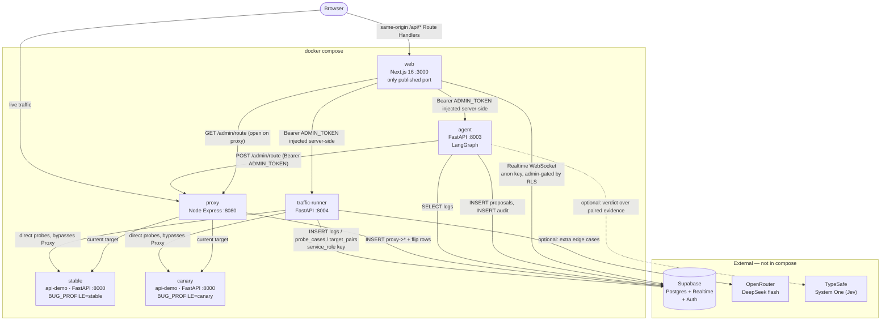
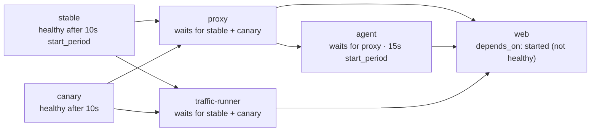
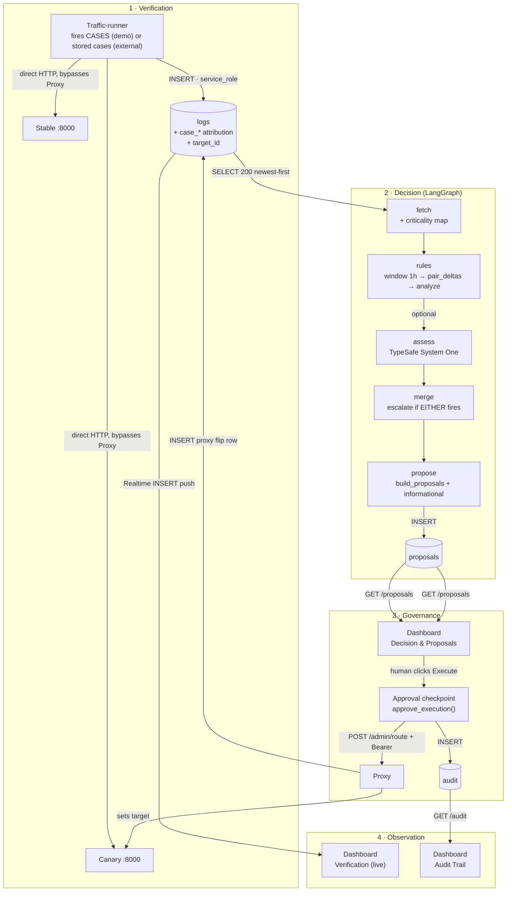
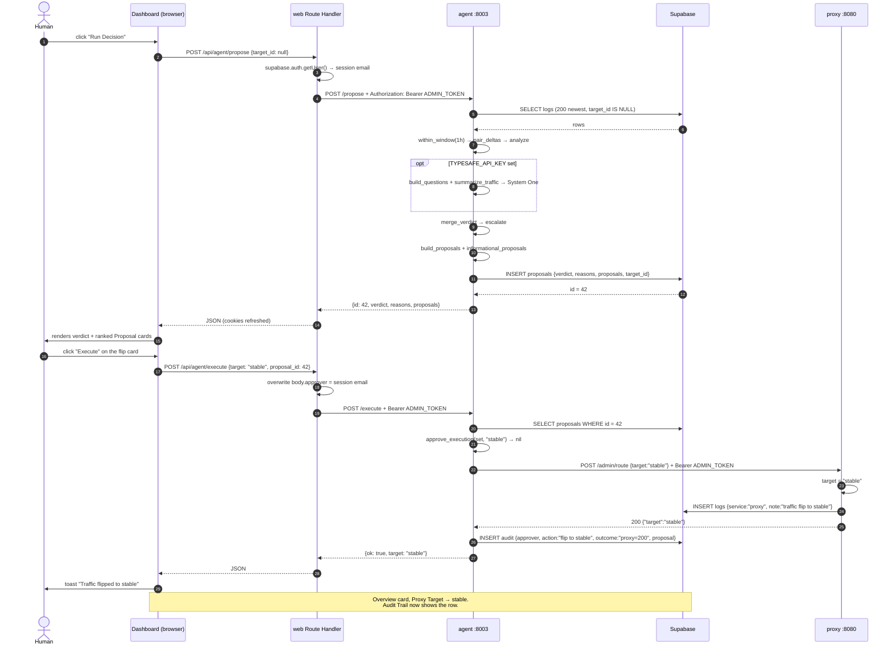
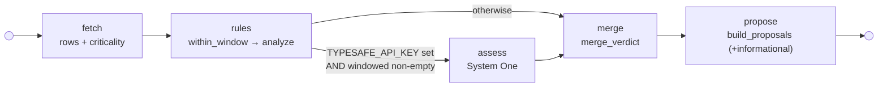
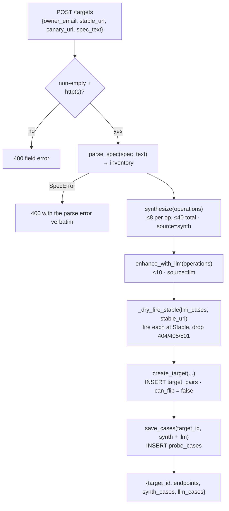

# GuardRail — Platform Guide

> **Canary deployment verifier with governance-gated remediation**
> End-to-end technical reference · IBM Bob 2.0 Hackathon · Sep 25–27, 2026

---

## 0. How to read this document

This is the **whole-platform** reference. It is not scoped to a track, a service, or a
tier — it walks every container, every file, every table, every constant, and every
request path in the repository, in the order data moves through the system.

| If you want to… | Read |
|---|---|
| Understand the product in 60 seconds | §1 |
| Learn the vocabulary (and the words to avoid) | §3 |
| See the container topology | §4 |
| Find any file in the repo | §5 |
| Trace one probe end to end | §6.3 |
| Understand the Decision engine | §11 |
| Understand the AI integrations | §12 |
| Configure it, bring it up, or fix a broken service | §17, §18 |
| Look up a constant | §21 |
| Know what's incomplete | §22 |

Terminology follows `CONTEXT.md` exactly. Where this document says **Stable**, it means
Stable — not "prod". Where it says **traffic flip**, it means the flip — not "rollback".
§3 lists the forbidden synonyms.

Companion documents:

| Document | What it covers |
|---|---|
| `CONTEXT.md` | The glossary (authoritative) |
| `docs/adr/0001…0004` | Architecture decision records |
| `docs/TEAM.md` | Team split and integration schedule |
| `docs/TRACK_A_PRESENTATION.md` | Track A pitch deck (⚠️ partially stale — see §22.1) |
| `.bob/artifacts/track-a-end-to-end-walkthrough.html` | Visual Track A walkthrough |

---

## 1. What GuardRail is

GuardRail is a **canary deployment verifier with a governance gate in front of the
remediation**. It answers two questions that most release tooling answers badly:

1. **Is the new version actually broken?** — answered by firing the *identical* request at
   Stable and Canary and comparing the two responses, request by request.
2. **If it is, what do we do, and who says so?** — answered by ranking remediation
   options by the severity of the evidence behind them, and refusing to change traffic
   until a logged-in human approves a specific, previously-persisted Proposal.

The platform has two modes of operation, and the mode is a property of the data, not of
the code path:

| Mode | Traffic | Probing | Outcome | How it is set |
|---|---|---|---|---|
| **Demo** | GuardRail owns Stable + Canary and a Proxy | Fixed canonical `CASES` spec, or generated from a spec | Full governance: verdict → ranked Proposals → human approval → **real traffic flip** → audit | `target_id` absent |
| **Advisory (BYO-API)** | A third party's own Stable + Canary URLs | Deterministic synthesis + LLM synthesis from their pasted OpenAPI spec | Verdicts and recommendations only. **Nothing is ever executed.** | `target_id` present (a UUID) |

That second mode is what turns the platform from a demo into a product: an engineer
pastes two URLs and an OpenAPI spec, and gets a canary-vs-stable regression report for
an API GuardRail has never seen and cannot deploy.

### Capability inventory

- Synthetic verification of two live versions with **request-level pairing** (not
  aggregate endpoint comparison).
- Deterministic **edge-case synthesis** from OpenAPI 3.x (drop-required, wrong-type,
  empty-string, enum violation, numeric bounds) plus optional **LLM-generated** cases.
- A **Decision engine** that classifies every request pair into one of six kinds and
  produces a single verdict: `escalate` or `keep`.
- An optional **calibrated decision model** (TypeSafe System One / "Jev") that reviews
  the paired evidence in parallel with the rules and is merged with them.
- **Ranked Proposals** carrying a derived severity, a blast radius, a reversibility
  statement, and the literal evidence rows behind them.
- A **human approval gate** that structurally cannot execute anything the Decision module
  did not previously persist and approve.
- An **append-only audit trail** recording approver, action, and outcome.
- A **live dashboard** with Realtime log streaming, proposal review, and the flip button.
- **Authentication** via Supabase Auth with a database-backed admin allowlist, and
  **zero write privileges** for browsers at the database level.

---

## 2. The problem

Canary deployments are standard practice and the tooling around them is bad in four
specific, repeatable ways:

| Failure mode | Why it happens | GuardRail's answer |
|---|---|---|
| A broken Canary gets promoted | A human eyeballs a dashboard, or the comparison is per-endpoint aggregate so noise hides signal | Request-level pairing — the same `(method, path, body)` fired at both sides is the strongest available signal |
| A healthy Canary gets killed | Panic flip on "it looked slow", with no baseline | Every latency claim is relative: Canary p95 vs **Stable** p95 on the *same* request, needing ≥2 samples per side |
| Rollbacks leave no trace | No record of who flipped what, when, or under which proposal | Append-only `audit` + a flip row in `logs`, both written by the actor that did it |
| Criticality is implicit | All endpoints treated equally; `/favicon.ico` noise sits next to `/checkout` | A criticality map that scales **severity**, and open external targets where the map is derived from the customer's own spec |

A fifth, subtler failure mode the codebase explicitly fixed:

| Failure mode | Why it happens | GuardRail's answer |
|---|---|---|
| A shared pre-existing failure masks a real one | The old rule bucketed by path *prefix* and required Stable to be clean for the whole prefix. One `GET /todos?limit=<overflow>` that 500s on both sides silenced twelve Canary-only `POST /todos` 500s | Bucketing by `(method, path, case_label)`. A shared failure and a Canary-only failure can never land in the same bucket. Regression test: `TestMaskingRegression` in `workers/agent/tests/test_compare.py` |

---

## 3. Domain language

Reproduced from `CONTEXT.md`, which is the source of truth.

| Term | Meaning | Do **not** say |
|---|---|---|
| **Stable** | The current production version serving live traffic by default | prod, master |
| **Canary** | The new version running side-by-side with Stable, carrying real planted bugs for verification | beta, preview |
| **Proxy** | The routing layer that sends live traffic to Stable or Canary and exposes the traffic flip | gateway, router |
| **Traffic flip** | The sole promotion mechanism: switching the Proxy target between Stable and Canary | promote, rollback, redeploy |
| **Traffic-runner** | The synthetic verifier that fires identical spec-derived requests at Stable and Canary directly | load tester, simulator |
| **Verification** | Side-by-side comparison of status, latency, and response diffs from Traffic-runner | monitoring, testing |
| **Criticality map** | Doc-ingest output ranking which endpoints changed and how severe a break is | changelog, spec summary |
| **Decision** | The verdict from aggregated metrics plus the Criticality map: `escalate` or `keep` | judgment, analysis |
| **Proposal** | A ranked remediation action with risk score, blast radius, and reversibility | suggestion, fix |
| **Approval checkpoint** | The human gate in the dashboard that must approve a Proposal before Execution | confirmation, sign-off |
| **Execution** | Running the approved traffic flip via the Proxy admin endpoint | action, run |
| **Audit trail** | The append-only record of every Proposal, Decision, approver, and outcome | log, history |

Two terms appear in the code but not the glossary:

| Term | Meaning | Where it lives |
|---|---|---|
| **Target pair** | A registered external Stable + Canary URL pair owned by one email | `target_pairs` table, `/targets` page |
| **Paired probe / Delta** | One request fired at both sides, plus what the pairing concluded | `domain/compare.py:Delta` |

---

## 4. System architecture

### 4.1 Container topology

Six containers, one external dependency (Supabase), one published port (`:3000`).



### 4.2 Ports and reachability

| Service | Container port | Published to host | Reached by the browser? | Reached by other containers? |
|---|---|---|---|---|
| `web` | 3000 | **3000** | Yes, directly | No |
| `proxy` | 8080 | No | No — only via `web`'s `/api/proxy/route` | `agent` (POST flip), `web` (GET target) |
| `agent` | 8003 | No | No — only via `web`'s `/api/agent/*` | `web` |
| `traffic-runner` | 8004 | No | No — only via `web`'s `/api/runner/*` and `/api/traffic/run` | `web` |
| `stable` | 8000 | No | No | `proxy` (live traffic), `traffic-runner` (probes) |
| `canary` | 8000 | No | No | `proxy` (live traffic), `traffic-runner` (probes) |

Everything except the dashboard is on the internal Compose network. The browser cannot
reach `proxy`, `agent`, or `traffic-runner` at all, which is why the Next.js Route
Handlers in §16.2 exist.

> **Note on `PORT` env vars.** `agent` and `traffic-runner` receive a `PORT` variable
> that their `config/settings.py` parses and exports, but their Dockerfiles launch
> `uvicorn … --port 8003` / `--port 8004` with a literal. Changing `PORT` in Compose
> therefore changes nothing. Only the Proxy actually reads `PORT` at runtime
> (`services/proxy/src/index.js` passes it to `app.listen`).

### 4.3 Startup ordering and healthchecks

Every service except `web` has a healthcheck; the others gate on `service_healthy`.



| Service | Probe | interval | timeout | retries | start_period |
|---|---|---|---|---|---|
| `stable`, `canary` | `urllib` GET `http://localhost:8000/health` | 5s | 3s | 5 | 10s |
| `proxy` | `node -e` GET `http://localhost:8080/health`, exit 0 on 200 | 5s | 3s | 5 | 10s |
| `traffic-runner` | `urllib` GET `http://localhost:8004/health` | 5s | 3s | 5 | 10s |
| `agent` | `urllib` GET `http://localhost:8003/health` | 5s | 3s | 5 | **15s** |
| `web` | none | — | — | — | — |

`traffic-runner`'s `lifespan` hook runs one demo probe batch on boot when
`RUN_ON_START=true` (the Compose default), so logs exist before anyone clicks anything.
A failure there is printed and swallowed — the service still serves.

### 4.4 Architectural decisions

Six decisions shape everything else. The first four are recorded ADRs; the last two are
load-bearing and only implicit in the code.

| # | Decision | Rationale | Consequence you must live with |
|---|---|---|---|
| 1 | **Docker Compose, not Vercel** (ADR-0001) | No trustworthy programmatic traffic-flip hook exists for a live rollback demo on serverless | One `docker compose up --build` runs everything; the demo needs no external network |
| 2 | **The traffic flip is the only promote/rollback mechanism** (ADR-0002) | Keeps Execution *real* and trivially reversible | Decision and Proposal logic must not assume deploy powers; flip cost is ~0 and fully reversible, which is why `reversibility` is always "instant" |
| 3 | **Hybrid backend: Node proxy, Python everything else** (ADR-0003) | `http-proxy-middleware` is the robust router; the rest of the team is Python-comfortable | The `logs` contract is implemented twice (`packages/contracts` for Node, `workers/shared/log_row.py` for Python) and must be kept in lockstep |
| 4 | **pnpm + Turbo monorepo, Compose builds each service from its folder** (ADR-0004) | Local dev and demo share the same Dockerfiles | The Proxy image is the one exception: it builds from the **repo root** so the `@guardrail/contracts` workspace dependency resolves |
| 5 | **Supabase is the single message bus** | One Postgres instance carries logs, proposals, audit, targets, cases, and the Realtime stream. No broker, no polling loop | Every service needs the service_role key. The dashboard talks to Postgres *directly* for reads and streams, and to the services *through* Next.js for writes |
| 6 | **The browser never holds a service credential** | The `ADMIN_TOKEN` is a service-to-service secret; the Supabase anon key is public by design | All mutating calls go through Next.js Route Handlers that check the session, inject the token, and stamp the caller's identity |

Two more behaviours are worth stating explicitly because they surprise people:

- **The Proxy's routing state is in memory only.** `services/proxy/src/index.js:20` holds
  `let target = "stable"`. Restarting the container resets traffic to Stable. The flip
  *event* is durable (it is written to `logs` and `audit`), but the *state* is not
  replayed on boot.
- **The Agent is stateless.** Every `/decide` and `/propose` call re-reads from Supabase.
  The LangGraph workflow has no checkpointer. The agent can be killed and restarted at any
  moment without losing context — the approval gate lives in the HTTP layer, not in the
  graph.

## 5. Repository map

A pnpm/Turbo monorepo over a Python monorepo, orchestrated by Docker Compose.

```text
guardrail/
├── CONTEXT.md                    Glossary — the vocabulary source of truth
├── AGENTS.md                     Agent instructions (issue tracker, labels, domain docs)
├── docker-compose.yml            The 6 services + their env
├── turbo.json                    Turbo task graph (build/dev/lint/typecheck, JS only)
├── pnpm-lock.yaml                Pinned deps — `pnpm install --frozen-lockfile` must exit 0
├── pnpm-workspace.yaml           apps/*, services/proxy, packages/*
│
├── packages/contracts/           TypeScript shared contract — consumed by the Proxy
│   └── src/
│       ├── index.ts              Barrel re-export
│       ├── service-name.ts       ServiceName + ServiceNameValue
│       ├── log-row.ts            LogRow, CaseAttribution, makeLogRow, isError
│       └── proposal.ts           Verdict, Proposal (minimal shape)
│
├── services/
│   ├── api-demo/                 Stable & Canary — ONE image, BUG_PROFILE selects behaviour
│   │   ├── app/
│   │   │   ├── main.py           Composition root, thin route wiring
│   │   │   ├── bugs.py           The planted Canary bugs — the entire bug surface
│   │   │   ├── schemas.py        Pydantic request shapes
│   │   │   └── settings.py       Env validation, fails fast
│   │   └── Dockerfile
│   └── proxy/                    Node Express routing + logging + flip
│       └── src/
│           ├── index.js          Composition root: routes, flip, proxy middleware
│           ├── config.js         Zod env validation, fails fast
│           ├── auth.js           timingSafeEqual Bearer gate for the admin surface
│           ├── logger.js         Fire-and-forget log writes + flip rows
│           ├── supabase.js       Client factory
│           ├── lib.js            Re-export shim (back-compat + test surface)
│           └── lib.test.js       node:test suite
│
├── workers/
│   ├── shared/                   The Verification spec — imported by BOTH workers
│   │   ├── verification.py       CASES, CRITICALITY, thresholds, tier_for_method
│   │   ├── log_row.py            make_log_row, ServiceName, error classification
│   │   └── test_verification.py  Spec invariants
│   ├── traffic-runner/           The synthetic verifier
│   │   ├── _paths.py             Makes shared/ importable in Docker and repo layouts
│   │   ├── api/app.py            HTTP layer + run loop + target registration
│   │   ├── domain/
│   │   │   ├── probe.py          fire_case / collect_rows (client-agnostic)
│   │   │   ├── spec_parse.py     OpenAPI 3.x → endpoint inventory
│   │   │   └── synthesize.py     Deterministic edge-case generation
│   │   ├── adapters/
│   │   │   ├── llm.py            OpenRouter case enhancement
│   │   │   └── store.py          Supabase: logs, target_pairs, probe_cases
│   │   └── config/settings.py
│   └── agent/                    The Decision engine
│       ├── _paths.py
│       ├── api/
│       │   ├── app.py            FastAPI routes — thin wiring only
│       │   └── schemas.py        Pydantic HTTP contract
│       ├── domain/               PURE. No I/O. Fully unit-tested.
│       │   ├── compare.py        Request pairing + classification (Delta)
│       │   ├── decision.py       Verdict, risk, Proposals, the approval gate
│       │   └── criticality.py    Static map + inventory-derived map
│       ├── adapters/
│       │   ├── store.py          Supabase: logs, proposals, audit, target inventory
│       │   ├── proxy.py          The traffic flip (HTTP)
│       │   └── jev.py            TypeSafe System One decision model
│       ├── workflow/             LangGraph
│       │   ├── state.py          The one AgentState TypedDict
│       │   ├── nodes.py          fetch → rules → assess → merge → propose
│       │   ├── edges.py          Conditional routing
│       │   └── builder.py        Assembly + compiled `workflow`
│       ├── config/settings.py
│       └── tests/                75 tests, no Supabase, no HTTP
│
├── apps/web/                     The dashboard (Next.js 16, React 19)
│   └── src/
│       ├── app/
│       │   ├── (dashboard)/      Gate + 5 pages
│       │   ├── login/            Public sign-in
│       │   └── api/              4 Route Handlers (the server-side forwarders)
│       ├── components/           auth, dashboard, layout, proposals, shared,
│       │                         targets, ui, verification, providers
│       ├── hooks/                use-logs, use-agent-queries, use-detection-metrics, query-keys
│       ├── lib/                  api client, supabase clients, query client
│       └── types/guardrail.ts    Hand-mirrored API types
│
├── supabase/migrations/          0001 → 0009, applied in order
├── docs/                         This file, ADRs, TEAM.md, TRACK_A_PRESENTATION.md
└── .bob/                         IBM Bob artifacts
```

### 5.1 The two-layer contract between the workers

`workers/shared/` exists so that **the Traffic-runner and the Agent cannot disagree about
what was probed or how bad it is.** It is copied into both Docker images (`/app/shared/`)
and importable from the repo (`workers/shared/`) via the `_paths.py` shim in each worker.

| Shared module | Consumed by | What it pins down |
|---|---|---|
| `verification.CASES` | `traffic-runner/api/app.py` | The four demo requests that are fired at both sides |
| `verification.CRITICALITY` | `agent/domain/criticality.py` | Which paths are `critical` vs `high` in demo mode |
| `verification.LATENCY_DEGRADATION_FACTOR` | `agent/domain/decision.py`, `agent/domain/compare.py` | The p95 ratio above which a read is a regression (2.0) |
| `verification.MIN_SAMPLES` | same | Samples per side before latency is trusted (2) |
| `verification.CRITICAL_METHODS` / `tier_for_method()` | the runner's synthesiser **and** the agent's inventory map | Mutating methods → `critical`, reads → `high`. One rule, both services |
| `log_row.make_log_row` | runner, agent | The exact row shape, the error threshold, the 500-char truncation, the auto-generated `trace_id` |

Adding a threshold in one place changes it in both. That is the point.

### 5.2 The cross-language contract

`packages/contracts` (TypeScript) and `workers/shared` (Python) implement the same domain
types for the two runtimes. Only the Proxy consumes the TypeScript side.

| Concept | TypeScript (`@guardrail/contracts`) | Python (`workers/shared/`) | Drift status |
|---|---|---|---|
| Canonical service names | `ServiceName.STABLE / CANARY / PROXY_EVENT / PROXY_TRAFFIC(t)` | `ServiceName` class + `proxy_traffic(t)` | ✅ in sync |
| Log row | `LogRow` + `makeLogRow(input)` | `make_log_row(**kwargs)` | ✅ in sync |
| Error threshold | `ERROR_THRESHOLD = 500` | `ERROR_THRESHOLD = 500` | ✅ |
| Error message cap | `ERROR_MSG_MAX_LEN = 500` | `ERROR_MSG_MAX_LEN = 500` | ✅ |
| `isError` | `isError(code)` | `is_error(code)` | ✅ |
| Case attribution | `CaseAttribution` (tier/source/label/method) | Four `make_log_row` kwargs | ✅ |
| Proposal shape | `Proposal` (4 fields) | full 8-field dict | ⚠️ TS type is a subset — see §22.2 |
| Probe cases / criticality / latency factor | not present (dashboard only displays) | `verification.py` | by design |

---

## 6. The data plane, end to end

### 6.1 The full pipeline



### 6.2 The approve → flip → audit sequence



### 6.3 One probe, traced all the way

The demo edge case `POST /checkout {}`, concretely, with real values.

```text
1. workers/shared/verification.py
   CASES[3] = ("POST", "/checkout", {})

2. traffic-runner/domain/probe.py :: collect_rows
   case index 4 → label = "demo:POST /checkout #4"
   tier = tier_for_method("POST") = "critical"   (POST ∈ CRITICAL_METHODS)
   source = "demo"

3. probe.py :: fire_case  (twice — once per service)
   payload = {}                                  (POST is not bodyless)
   r = client.request("POST", "http://canary:8000/checkout", json={})
   t0 → latency_ms = int((perf_counter() - t0) * 1000)   → 6

4. Canary:  services/api-demo/app/main.py :: checkout
   body.item_id is None → checkout_result("canary", None)
   → JSONResponse(status_code=500, content={"error": "boom: item_id missing"})

5. workers/shared/log_row.py :: make_log_row
   status_code = 500, latency_ms = 6, error_text = r.text
   error_message = error_msg(text, 500) → text[:500]      (truncated, non-null)
   note = None, trace_id = str(uuid4())
   case_tier="critical", case_source="demo",
   case_label="demo:POST /checkout #4", case_method="POST"

6. INSERT into logs  (service_role bypasses RLS)

7. Stable: same request → item_id None → (400, {"error": "item_id required"})
   → error_message is NULL because 400 < ERROR_THRESHOLD

8. agent/domain/compare.py :: request_key
   ("POST", "/checkout", "demo:POST /checkout #4")     ← identical for both rows

9. _classify → canary_errors=1, stable_errors=0 → CANARY_ERROR

10. domain/decision.py
    group_deltas   → one group (route "POST /checkout", kind canary_error)
    describe       → "POST /checkout 5xx on canary in 1/1 probes (500) while
                      stable answers 400 (0/1 errors) — canary-only failure
                      [demo:POST /checkout #4]"
    risk_of        → 0.70 × 1.0 × (0.55 + 0.45 × 1.0) = 0.70
    build_proposals → [{kind:"flip", risk:0.70, execute:{target:"stable"}},
                       {kind:"canary_error", risk:0.70, execute:null}]
    verdict         → "escalate"
```

And the latency bug, `GET /search?q=*`:

| Side | Handler | Latency | Row |
|---|---|---|---|
| Stable | `search_results("stable", q)` | ~1ms | 200, `error_message: NULL` |
| Canary | `asyncio.sleep(0.8)` first | ~805ms | 200, `error_message: NULL` |

`case_method="GET"` → tier `high`. With `CASE_REPEATS=2` (external) the latency rule has
2 samples per side and classifies the pair as `latency_regress`; in demo mode there is
1 sample per side, so the pair is correctly classified `ok` — see §11.4 for why.

### 6.4 Who writes what, and with which credential

| Writer | Table(s) | Credential | RLS |
|---|---|---|---|
| Traffic-runner | `logs`, `target_pairs`, `probe_cases` | `SUPABASE_SERVICE_KEY` | Bypassed (service_role) |
| Proxy | `logs` | `SUPABASE_SERVICE_KEY` | Bypassed |
| Agent | `proposals`, `audit`; reads `logs`, `target_pairs` | `SUPABASE_SERVICE_KEY` | Bypassed |
| Browser | **reads** `logs`, `proposals`, `audit` only | `NEXT_PUBLIC_SUPABASE_ANON_KEY` | Admin-gated `SELECT` policies |
| Browser | no writes at all | — | No INSERT/UPDATE/DELETE policy exists |

## 7. `api-demo` — Stable and Canary

`services/api-demo` is **one image**. `docker-compose.yml` runs it twice with a different
`BUG_PROFILE`. This is deliberate: the platform must prove it works against a real code
difference, not against a mock that returns canned statuses.

### 7.1 Layout

| File | Role |
|---|---|
| `app/main.py` | Composition root. `FastAPI(title=f"guardrail-demo-{BUG_PROFILE}")`, three routes, thin wiring. Re-exports `app`, `BUG_PROFILE`, `Checkout` for import compatibility. |
| `app/bugs.py` | The entire bug surface. Two functions, one constant. |
| `app/schemas.py` | `Checkout(BaseModel)`: `item_id: str \| None = None`, `qty: int = 1` |
| `app/settings.py` | `Settings(BaseSettings)` with `bug_profile: Literal["stable","canary"]`; `sys.exit(1)` with a printed message on invalid env |

### 7.2 Routes

| Method | Path | Handler | Behaviour |
|---|---|---|---|
| `GET` | `/health` | `health()` | `{"ok": true, "profile": "<BUG_PROFILE>"}` |
| `GET` | `/search?q=x` | `search(q="x")` | `await search_results(BUG_PROFILE, q)` |
| `POST` | `/checkout` | `checkout(body: Checkout, response: Response)` | `checkout_result(BUG_PROFILE, body.item_id)` |

`checkout` handles a slightly awkward contract: `checkout_result` returns
`(status, payload)` where `status` is `None` when the payload is already a
`JSONResponse` (the Canary 500 path) and an `int` when the caller should set
`response.status_code` (the Stable 400 path).

### 7.3 The planted bugs

`services/api-demo/app/bugs.py`, in full, is the bug surface:

```python
CANARY_SEARCH_LATENCY_SECONDS = 0.8

async def search_results(profile: str, q: str) -> dict:
    if profile == "canary":
        await asyncio.sleep(CANARY_SEARCH_LATENCY_SECONDS)
    return {"profile": profile, "q": q, "results": [q]}

def checkout_result(profile: str, item_id: str | None):
    if not item_id:
        if profile == "canary":
            return None, JSONResponse(status_code=500, content={"error": "boom: item_id missing"})
        return 400, {"error": "item_id required"}
    return None, {"ok": True, "profile": profile, "item_id": item_id}
```

| Endpoint | Input | Stable | Canary | Tier | Kind produced |
|---|---|---|---|---|---|
| `GET /search` | any `q` | ~1ms, 200 | **+800ms**, 200 | high | `latency_regress` (needs ≥2 samples/side) |
| `POST /checkout` | `{"item_id":"a","qty":1}` | 200 `ok` | 200 `ok` | critical | `ok` — no regression, by design |
| `POST /checkout` | `{}` | **400** validation error | **500** crash | critical | `canary_error` |
| `GET /health` | — | 200 | 200 | — | never probed |

The happy path is included on purpose: a verifier that fires only edge cases cannot show
that it distinguishes "the Canary is broken" from "the endpoint is broken". Three of the
four cases produce a non-regression, so the Decision has something correct to say about
the Canary too.

The 800ms sleep uses `asyncio`, so it yields the event loop — a single FastAPI process
handles the other requests normally while the sleep is in flight.

---

## 8. `proxy` — routing, logging, and the flip

`services/proxy` is the only component that can change where live traffic goes, and it
does it behind one interface.

### 8.1 Module map

| File | Contents |
|---|---|
| `index.js` | `parseEnv(process.env)` → Express app → `/health`, `GET /admin/route`, `POST /admin/route` (gated) → logging middleware → `createProxyMiddleware` on `/` |
| `config.js` | `EnvSchema` (Zod) and `parseEnv` which `process.exit(1)` with a per-issue message list |
| `auth.js` | `isAuthorized(header, token)` + `createAdminAuth(token)` middleware |
| `logger.js` | `makeFlipRow(target)`, `createLogger(client)` → `{logRow, logFlip, trafficMiddleware}` |
| `supabase.js` | `createSupabaseClient(url, key)` — returns `null` if either is falsy |
| `lib.js` | Re-export shim preserving the pre-split import path; also the test surface |
| `lib.test.js` | 9 `node:test` tests over `parseEnv`, `makeFlipRow`, `createAdminAuth`, `createLogger` |

### 8.2 Env contract (`config.js`)

| Var | Rule | Default |
|---|---|---|
| `PORT` | coerced positive int | `8080` |
| `STABLE_URL` | valid URL | `http://stable:8000` |
| `CANARY_URL` | valid URL | `http://canary:8000` |
| `SUPABASE_URL` | valid URL | **required** |
| `SUPABASE_SERVICE_KEY` | min length 1 | **required** |
| `ADMIN_TOKEN` | **min length 16** | **required** |

Failure prints `❌  Missing or invalid environment variables:` followed by
`path: message` per issue, then exits 1.

### 8.3 HTTP surface

| Method | Path | Auth | Response |
|---|---|---|---|
| `GET` | `/health` | open | `{"ok": true, "target": "<current>"}` |
| `GET` | `/admin/route` | open | `{"target": "<current>"}` |
| `POST` | `/admin/route` | `Bearer ADMIN_TOKEN` | `{"target": "<new>"}`, or 400 `{"error": 'target must be "stable" \| "canary"'}` |

Everything else is proxied. The middleware stack order matters:

```js
app.use(express.json());
app.get("/health", …);
app.get("/admin/route", …);
app.post("/admin/route", requireAdmin, …);   // sets target, logs the flip
app.use(logger.trafficMiddleware(getTarget));  // logs every proxied response
app.use("/", createProxyMiddleware({ router: () => targets[target], … }));
```

`GET /admin/route` stays open deliberately so the dashboard can render the current target
with a plain read; `POST` is the privileged operation and is gated. The dashboard reaches
the GET through its own session-gated Route Handler (§16.2), so the browser still cannot
see the Proxy.

### 8.4 The routing target

```js
let target = "stable";
const getTarget = () => target;
const targets = { stable: env.STABLE_URL, canary: env.CANARY_URL };
```

`createProxyMiddleware` receives `router: () => targets[target]`, evaluated **per
request** — so the next request after a flip goes to the new target with no restart and
no connection draining. In-memory only: a container restart returns traffic to Stable.

`on: { proxyReq: fixRequestBody }` re-serialises the body `express.json()` already
consumed, so `POST /checkout` reaches the Canary intact.

### 8.5 Logging — two row shapes

| Row kind | `service` | `endpoint` | `status_code` | `latency_ms` | `note` | `error_message` |
|---|---|---|---|---|---|---|
| Proxied traffic | `proxy->stable` / `proxy->canary` | `req.originalUrl` | `res.statusCode` | `Date.now() - started` | `null` | `proxy saw <code>` when ≥500, else `null` |
| Traffic flip | `proxy` | `/admin/route` | `200` | `0` | `traffic flip to <target>` | always `null` |

Both go through `makeLogRow` from `@guardrail/contracts`, so `trace_id` is auto-generated
(`crypto.randomUUID()`), `timestamp` is stamped at write time, and `error_message` is
truncated to 500 characters and forced to `null` for non-errors.

Two subtleties in `trafficMiddleware`:

- The service name is resolved by calling `getTarget()` **inside** the `res.on("finish")`
  handler, so the row records the target that was active when the response completed. A
  flip that happens mid-flight can therefore label a request with the new target. This is
  a display concern only — the Decision ignores `proxy->*` rows entirely (§11.2).
- `res.on("finish")` does not fire for a client-aborted request, so aborted proxied
  requests are never logged.

**Logging never blocks proxying.** `logRow` wraps the insert in `try { … } catch { }`
with a `// never block proxying on logging` comment, and is invoked with `void` from the
`finish` handler. A Supabase outage costs you log rows, not traffic.

### 8.6 The admin auth gate

```js
export function isAuthorized(header, expectedToken) {
  if (typeof header !== "string" || !expectedToken) return false;
  const expected = `Bearer ${expectedToken}`;
  const a = Buffer.from(header), b = Buffer.from(expected);
  if (a.length !== b.length) return false;
  return timingSafeEqual(a, b);
}
```

`crypto.timingSafeEqual` requires equal-length buffers, so the length check is a
necessary guard, not a shortcut — a wrong-length guess returns `false` without a
comparison. `createAdminAuth` returns `401 {"error": "unauthorized"}` and does not call
`next()` on failure.

---

## 9. `traffic-runner` — the synthetic verifier

Port 8004. Four responsibilities: run the demo spec, run a registered target's stored
cases, register a new target (parse → synthesise → LLM → dry-fire → persist), and stream
its results to Supabase. It has **no opinion** about what the results mean.

### 9.1 Package layout

| Layer | Path | Rule |
|---|---|---|
| HTTP | `api/app.py` | Routes, request bodies, the run loop, `lifespan` |
| Domain | `domain/probe.py` | `fire_case`, `collect_rows` — no httpx, no Supabase |
| Domain | `domain/spec_parse.py` | OpenAPI text → inventory. No LLM, no network |
| Domain | `domain/synthesize.py` | Inventory → capped case list. Pure |
| Adapters | `adapters/llm.py` | OpenRouter enhancement. Never raises |
| Adapters | `adapters/store.py` | Supabase: `logs`, `target_pairs`, `probe_cases` |
| Config | `config/settings.py` | Pydantic env validation, `sys.exit(1)` on failure |

### 9.2 HTTP surface

| Method | Path | Auth | Purpose |
|---|---|---|---|
| `GET` | `/health` | open | `{"ok": true, "cases": 4, "services": 2}` |
| `POST` | `/run` | `Bearer ADMIN_TOKEN` | Fire a batch. Body `{target_id?}` — absent = demo batch |
| `POST` | `/targets` | `Bearer ADMIN_TOKEN` | Register an external pair. Body `{owner_email, stable_url, canary_url, spec_text}` |
| `GET` | `/targets?owner=…` | `Bearer ADMIN_TOKEN` | List the caller's target pairs, newest first |
| `GET` | `/targets/{id}/cases` | `Bearer ADMIN_TOKEN` | The stored generated cases |

`POST /targets` validates non-empty `owner_email`/`stable_url`/`canary_url` and requires
both URLs to start with `http://` or `https://`; a `SpecError` or `ValueError` becomes a
`400` whose `detail` is the human-readable parse error shown verbatim in the UI.

`POST /run` returns `{"ok": true, "rows": N, "by_service": {"stable": n, "canary": n},
"target_id": …}`; an unknown `target_id` becomes a `404`.

Auth is `hmac.compare_digest` against `f"Bearer {ADMIN_TOKEN}"` — timing-safe, and
`/health` is excluded from the dependency.

### 9.3 `fire_case` — the atomic probe

`domain/probe.py` is client-agnostic on purpose: it takes anything with
`.request(method, url, json=…)`, so it is testable with a stub and reusable for a
synchronous or asynchronous client.

```python
method = method.upper()
t0 = time.perf_counter()
payload = None if method in _BODYLESS else body       # _BODYLESS = {GET, HEAD, DELETE}
try:
    r = client.request(method, base + path, json=payload)
except Exception as e:
    return _row(599, str(e))                            # transport failure is a 599 row
if skip_noise and r.status_code in _ROUTING_NOISE:      # {404, 405, 501}
    return None                                         # caller drops the case entirely
return _row(r.status_code, r.text)
```

Four decisions encoded here:

| Decision | Why |
|---|---|
| **The real method is sent.** A case that says `PUT` must not arrive as `POST` | Otherwise the handler under test is never reached and every response is a `405` |
| **Bodyless methods drop the body.** `GET`/`HEAD`/`DELETE` never send `json=` | Avoids a spurious `Content-Type` on methods that have no body |
| **A transport exception becomes a `599` row with the exception text** | An unreachable Canary is a finding, not a crash. `599 ≥ 500` so it classifies as an error |
| **`skip_noise` drops 404/405/501 rows entirely** | These mean "this route doesn't exist", not "this route is broken". They are excluded from `logs` so they cannot dilute a real finding. Other 4xx and all 5xx are kept — a `422` is signal |

Note the difference between the two callers: the demo batch (`collect_rows`) does **not**
pass `skip_noise` and does **not** repeat; the external batch (`run_target_once`) does
both. Demo rows always land, external rows are filtered down to routes Stable actually
serves.

### 9.4 Demo mode — `run_once`

```python
def run_once() -> list[dict]:
    client = sb()
    with httpx.Client(timeout=10) as c:
        rows = collect_rows(c, CASES, SERVICES)   # CASES × [(stable, STABLE), (canary, CANARY)]
    save_rows(client, rows)
    return rows
```

`collect_rows` derives the attribution the bare `CASES` tuples don't carry:

```python
for i, (method, path, body) in enumerate(cases, start=1):
    label = f"demo:{method} {path} #{i}"                 # e.g. "demo:POST /checkout #4"
    for service, base in services:
        fire_case(…, tier=tier_for_method(method), source="demo", label=label)
```

This yields **8 rows per run** (4 cases × 2 services), each with
`case_tier` from the method rule, `case_source="demo"`, a positional `case_label`, and
`case_method` — exactly the `(method, path, label)` key the Decision pairs on. `target_id`
stays `NULL`, which is how demo rows are distinguished from external rows at query time
(`q.is_("target_id", "null")`).

`save_rows` is a single batched `client.table("logs").insert(rows).execute()` and is a
no-op when no client could be built.

### 9.5 External mode — `run_target_once`

```python
target = get_target(client, target_id)          # 404 if unknown
cases  = get_cases(client, target_id)           # method, path, body, tier, source, label
services = [(STABLE, target["stable_url"]), (CANARY, target["canary_url"])]

for case in cases:
    for _ in range(CASE_REPEATS):               # 2 by default
        for service, base in services:
            row = fire_case(c, service, base, case["method"], case["path"], case["body"],
                            tier=case["tier"], source=case["source"],
                            label=case["label"], skip_noise=True)
            if row: row["target_id"] = target_id; rows.append(row)
save_rows(client, rows)
```

`CASE_REPEATS` exists so latency percentiles have real samples without inflating the
stored case list: 31 cases × 2 sides × 2 repeats = 124 rows, and each request pair has 2
samples per side — exactly `MIN_SAMPLES`. `target_id` is stamped onto the row *after*
`make_log_row` because the shared constructor has no knowledge of targets.

URLs are `.rstrip("/")`-ed at use time, so a trailing slash in the connect form cannot
produce `https://host//checkout`.

### 9.6 OpenAPI parsing — `domain/spec_parse.py`

Input is spec **text**; output is an endpoint inventory. No network, no LLM.

```python
{"version": "3.0.3", "operations": [
  {"method": "POST",
   "path_template": "/todos",
   "params": [{"in": "query", "name": "limit", "required": True, "schema": {...}},
              {"in": "path",   "name": "id",   "required": True, "schema": {...}}],
   "body_schema": {"type": "object", "required": ["title"], "properties": {...}}}
]}
```

| Step | Behaviour | Failure message |
|---|---|---|
| `_load` | `yaml.safe_load` when PyYAML is importable, else `json.loads` | `spec is not valid YAML/JSON: …` |
| object check | must be a dict | `spec must be a YAML/JSON object` |
| `_resolve` | inlines local `#/…` `$refs`; JSON-Pointer unescaping for `~0`/`~1` | `only local $refs supported, got: …`, `$ref target missing: …`, `spec has excessively nested $refs (possible cycle)` |
| version | `openapi` must start with `"3."` | `only OpenAPI 3.x supported, got: '…'` |
| paths | `paths` must be a non-empty dict | `spec has no paths to probe` |
| operations | iterates `get/post/put/patch/delete/head/options`; merges path-level and operation-level `parameters`; `required` defaults to `in == "path"` | — |
| requestBody | first `application/json` content schema, else `None` | — |
| result | at least one operation | `no probeable operations found under paths` |

`$ref` resolution is depth-limited to `_REF_DEPTH_LIMIT = 10` and cycle-safe, because
recursive schemas (`Tree` containing `Tree`) are common in real specs and would otherwise
hang the parser. Remote `$ref`s are rejected explicitly rather than left dangling.

Helper functions:

| Function | Behaviour |
|---|---|
| `example_for(schema)` | `example` → `default` → `enum[0]` → `minimum` or `1` / `1.0` (number) → `True` (bool) → `[example(items)]` (array) → `{k: example}` (object) → `"1"` |
| `fill_path(template, params, values)` | Replaces `{name}` with `values[name]` or `example_for(schema)` |
| `query_string(params, values)` | Only params **present in `values`**, required first; a param absent from `values` is *omitted*, which is how "drop this required param" is expressed. No URL encoding is applied |

### 9.7 Deterministic synthesis — `domain/synthesize.py`

`MAX_CASES_PER_OP = 8`, `MAX_TOTAL_CASES = 40`. Tier is `tier_for_method(op["method"])`;
`source` is always `"synth"`. For each operation, in order:

| # | Strategy | Label | Case |
|---|---|---|---|
| 1 | Happy path | `happy-path` | every param filled with its example, body filled from the schema |
| 2 | Drop each **required query param** | `drop-required:<name>` | that param omitted from the values dict; `query_string` drops it from the URL |
| 3 | Drop each **required body property** | `drop-required:<name>` | the property removed from the example body |
| 4 | Wrong-type each query param | `wrong-type:<name>` | `_wrong_value()` on its example |
| 5 | Wrong-type each body property | `wrong-type:<name>` | `str → 12345`, `int/float → "not-a-number"`, `bool → "maybe"`, `list → {}`, `dict → []` |
| 6 | Empty-string each string body property | `empty-string:<name>` | only for properties whose example is a `str` |
| 7 | Enum violation | `enum:<name>` | `"invalid-enum-value"` in an `enum` slot |
| 8 | Numeric bounds | `bound-minimum:<name>`, `bound-maximum:<name>` | `minimum - 1` and `maximum + 1` |

Two implementation details worth knowing: `_param_overrides(…, skip=)` expresses strategy 2
and `_param_overrides(…, wrong=)` expresses strategy 4, both by controlling which keys land
in the values dict rather than by post-processing a URL. And the loop `break`s once
`MAX_TOTAL_CASES` is reached, so a 40-operation spec truncates rather than running
thousands of probes — the truncation is silent, which is a known sharp edge (§22.4).

### 9.8 LLM enhancement — `adapters/llm.py`

An **upgrade, never a dependency**. `enhance_with_llm` returns `[]` on *any* failure —
no key, timeout, non-200, unparseable JSON, unexpected shape — so registration always
succeeds with synth-only cases if OpenRouter is unavailable.

Request:

```http
POST https://openrouter.ai/api/v1/chat/completions
Authorization: Bearer $OPENROUTER_API_KEY
X-Title: GuardRail canary verifier
{ "model": "<LLM_MODEL>",                       # default deepseek/deepseek-v4.1-flash
  "messages": [ {"role": "system",  "content": _SYSTEM},
                {"role": "user",    "content": "Endpoints:\n" + _inventory_text(ops)} ],
  "response_format": {"type": "json_object"} }
```

The system prompt asks for `{"cases": [{"method", "path", "body", "tier", "why"}]}`,
restricts the model to the listed method+path combinations, requires `{path}` params to be
filled with plausible values, and caps output at 4 cases per endpoint. Timeout 60s.

The user message renders each operation as
`METHOD /path [query:limit*<integer> path:id*<string>] body={title*<string>, done*<boolean>}`
— `*` marks required, `<type>` comes from the schema.

Every returned case is validated against the inventory before it is kept:

| Check | Rejection |
|---|---|
| Is a dict, with a non-empty method and a path starting with `/` | drop |
| Does `(method, path)` match a known operation, comparing segment-wise with `{x}` as `[^/]+` | drop |
| Is the body JSON-serialisable | drop |
| Tier is `critical`/`high` | keep as given, else derive from the method rule |

Survivors are capped at `_MAX_LLM_CASES = 10`, tagged `source="llm"`, and labelled with
the model's first line of `why` truncated to 80 characters (or `"llm-case"` if absent).
Labels are bounded because they land on every log row the case produces *and* are quoted
verbatim in proposal evidence.

`_template_match` is the safety net: the model may not invent endpoints. It builds
`^…$` from the template with `{…}` replaced by `[^/]+`, ignoring the query string, so a
suggested `/todos/42` legitimately matches the template `/todos/{id}`.

## 10. `agent` — the Decision engine

Port 8003. This is the intelligence layer and the only service with a non-trivial
internal architecture.

### 10.1 Layer map

| Layer | Path | May import | Rule |
|---|---|---|---|
| **HTTP** | `api/app.py`, `api/schemas.py` | everything | Thin wiring. No business logic. |
| **Workflow** | `workflow/` | domain, adapters, config | LangGraph. Nodes move data; they do not compute |
| **Domain** | `domain/compare.py`, `domain/decision.py`, `domain/criticality.py` | `workers/shared` **only** | **Zero I/O.** No Supabase, no HTTP, no env. Fully unit-tested |
| **Adapters** | `adapters/store.py`, `adapters/proxy.py`, `adapters/jev.py` | domain, config | All I/O lives here |
| **Config** | `config/settings.py` | — | Validates env at import; `sys.exit(1)` on failure |

The domain layer's only external import is `_paths` (to make `workers/shared` importable)
and the two shared modules. That constraint is what makes `tests/` need no database, no
HTTP server, and no mocks: the test file sets three dummy env vars and imports the real
modules.

### 10.2 HTTP surface

| Method | Path | Auth | Request | Response |
|---|---|---|---|---|
| `GET` | `/health` | open | — | `{"ok": true}` |
| `POST` | `/decide` | `Bearer ADMIN_TOKEN` | `{target_id?}` | `{verdict, reasons}` — **no persistence** |
| `POST` | `/propose` | `Bearer ADMIN_TOKEN` | `{target_id?}` | `ProposalSet {id, verdict, reasons, proposals}` |
| `GET` | `/proposals` | open in-cluster | — | Last 10 sets, newest first |
| `GET` | `/audit` | open in-cluster | — | Last 20 execution records, newest first |
| `POST` | `/execute` | `Bearer ADMIN_TOKEN` | `{target, approver, proposal_id, target_id?}` | `{ok, target}` or `422 {detail}` |

`Target` is a `Literal["stable", "canary"]` — the only two legal flip targets, mirroring
ADR-0002. `Approve.approver` has a non-blank validator and **must not be empty**; `proposal_id`
is a required `int`. `TargetBody` is optional everywhere, so `POST /decide` with no body at
all is legal and means "demo traffic".

**No CORS middleware, on purpose.** The comment in `api/app.py` is explicit: browsers reach
the agent only through the web server's same-origin `/api/agent/*` forwarders, so
cross-origin browser access is intentionally unsupported. Server-to-server calls are
unaffected. Adding CORS would be a regression, not a feature.

`/health`, `/proposals`, and `/audit` are unauthenticated *inside the Compose network*.
They are still effectively gated, because the only path from a browser is the
session-gated forwarder. If you ever expose the agent's port, add auth to those three.

### 10.3 The LangGraph workflow

`workflow/builder.py` compiles once at import:



| Node | File | Reads | Writes to state | Never |
|---|---|---|---|---|
| `fetch` | `nodes.py:20` | `sb()`, `get_target_inventory` | `rows`, `crit`, `now` | Mutate anything |
| `rules` | `nodes.py:37` | state | `windowed`, `analysis`, `deltas`, `rules_verdict`, `rules_reasons` | Touch Supabase |
| `assess` | `nodes.py:51` | `deltas` | `jev` (dict or `None`) | Raise |
| `merge` | `nodes.py:59` | rules + jev | `verdict`, `reasons` | — |
| `propose` | `nodes.py:67` | `analysis`, `verdict` | `proposals`, `proposal_id` | Persist unless asked |

**`AgentState`** (`workflow/state.py`) is one flat `TypedDict, total=False` with three
groups of keys: control (`persist`, `now`, `target_id`), per-stage outputs
(`rows`, `crit`, `windowed`, `deltas`, `analysis`, `rules_verdict`, `rules_reasons`,
`jev`, `verdict`, `reasons`, `proposals`, `proposal_id`). LangGraph's default reducer is
overwrite, and every node returns a **partial** dict. Nodes are thin orchestrators on
purpose: the arithmetic lives in `decision.py` and `jev.py`, the I/O in `store.py`, and
`nodes.py` is just plumbing. That is what keeps the interesting logic testable without
instantiating a graph.

**The `persist` flag** is carried in-band rather than by having two graphs. `run_analysis(persist=False)`
serves `/decide`; `run_analysis(persist=True, target_id=…)` serves `/propose`. Same
compiled object, same nodes, one boolean.

**No checkpointer.** Each `workflow.invoke(...)` is a fresh, stateless pass. The module
docstring is explicit that this is a deliberate simplification for the demo and that the
documented next step — when runs must pause mid-graph — is a stateful interrupt plus a
Postgres checkpointer. The human approval gate is therefore **not** a graph interrupt; it
lives in `POST /execute` as a `proposal_id` allowlist check against the persisted row.

### 10.4 Adapters

`adapters/store.py`:

| Function | Behaviour on failure |
|---|---|
| `sb()` | Always returns a client (env is validated at import) |
| `fetch_recent_rows(client, limit=200, target_id=None)` | **No try/except** — a fetch failure is a real failure and surfaces as a 500. Ordered `timestamp` desc. `target_id` present → `.eq("target_id", id)`; absent → `.is_("target_id", "null")` |
| `save_proposals(...)` | Returns `None` on any exception — "history is advisory — never block the Decision" |
| `_list_recent(client, table, limit)` | Returns `[]` on any exception — "a missing table never blocks the Decision" |
| `list_proposals(client, limit=10)` / `list_audit(client, limit=20)` | Newest first via `created_at desc` |
| `get_proposal_set(client, id)` | `None` on failure or missing row — the gate's first rejection reason |
| `get_target_inventory(client, id)` | `None` on failure, missing row, or non-list `inventory` |
| `record_audit(...)` | **No try/except** — a failed audit record is worth surfacing, and the flip has already happened by then (§22.3) |

`adapters/proxy.py` is seven lines: `flip_proxy(target)` POSTs `PROXY_ADMIN_URL` with
`{"target": target}` and `Authorization: Bearer ADMIN_TOKEN`, 5s timeout, returns the
status code. The agent does not inspect the body — a `200` is the whole contract, and any
other code is recorded faithfully in the audit `outcome` as `proxy=<code>`.

`adapters/jev.py` is §12.1.

---

## 11. The Decision engine

Implemented in `workers/agent/domain/compare.py` and `domain/decision.py`. **Pure
functions over plain dicts.** No I/O, no clock (the caller passes `now`), no env. 75 tests
cover this layer plus the Jev merge and the graph routing.

The unit of analysis is the **request**, not the endpoint. The Traffic-runner fires the
same `(method, path, body)` at both sides, so joining those two rows is the strongest
signal available — and it is strictly more informative than comparing blind per-endpoint
aggregates, where a fast failure and a slow success are indistinguishable.

### 11.1 The funnel

```text
run_analysis(persist, target_id)
  └─ fetch    : SELECT 200 newest-first rows (target-scoped) + a criticality map
  └─ rules    : within_window(rows, now, 3600s)
                └─ analyze(windowed, crit, latency_factor)
                     └─ pair_deltas(rows, crit)      → [Delta, …]  worst first
                     └─ group_deltas(deltas)          → [[Delta, …], …]  one per (route, kind)
                     └─ reasons = describe(regressions) + describe(non-regressions)
                     └─ verdict = "escalate" if any regression else "keep"
  └─ assess?  : optional TypeSafe System One call
  └─ merge    : escalate if EITHER rules or Jev fired
  └─ propose  : build_proposals(...)  [+ informational_proposals(...) when escalating]
                save_proposals(...) only when persist
```

### 11.2 Pairing — `pair_deltas`

Rows are filtered to `service in ("stable", "canary")` first, so **`proxy->*` rows are
never part of a Decision**. Remaining rows are bucketed by `request_key`:

```python
def request_key(row):
    label = row.get("case_label")
    path = path_of(row["endpoint"]) if label else row["endpoint"]
    return (method_of(row), path, label or row["endpoint"])
```

Three components, each solving a specific problem:

| Component | Source | Problem it solves |
|---|---|---|
| `method_of` | `case_method`; else `^demo:([A-Z]+)\b` from `case_label`; else `"ANY"` | `GET /todos` and `DELETE /todos` are different requests. Pre-`0008` rows have no `case_method`, so the method is recovered from the demo label — otherwise one route would split into an `ANY` bucket and a `POST` bucket and report one finding twice. A method is **never guessed** from an LLM label: `"GET requires auth"` is not a method |
| `path_of(endpoint)` | `endpoint.split("?", 1)[0]` | `?q=normal` vs `?q=edge` are two cases, but URL-encoding differences on the *same* case must not fork a bucket. A case **label** is the request identity; the path is just the route |
| `case_label` | The row's attribution column | Six failing bodies on `POST /todos` are six findings, not one bucket. Falls back to the full endpoint (query included) for unattributed rows so demo-era distinct cases stay distinct |

Each bucket becomes a `Delta`:

| Field | Value |
|---|---|
| `n_stable`, `n_canary` | Row counts per side |
| `stable_statuses`, `canary_statuses` | Tuples of every status seen, in arrival order |
| `p95_stable`, `p95_canary` | `percentile(latencies, 0.95)` per side, or `None` |
| `tier` | First `case_tier` seen, else `tier_of(crit, path)`, else `"high"` |
| `label`, `source` | First attribution seen in the bucket |
| `kind` | Set by `_classify` (below) |

`percentile` clamps rather than over-indexing: `idx = min(int(len(ordered) * q), len(ordered) - 1)`.
For `n=1` that is index 0; for `n=2` at q=0.95 it is index 1, i.e. the max. It raises on an
empty list, which cannot happen because the caller guards with `if s_lat else None`.

Derived properties used by reasons, proposals, and the Jev summary: `route` (`"POST /todos"`),
`canary_errors` / `stable_errors` (count of `is_error`), `hit_rate` (`canary_errors / n_canary`),
`latency_ratio` (`p95_canary / p95_stable`, `None` when stable had no samples), and
`is_regression` (`kind in REGRESSION_KINDS`).

### 11.3 Classification — the six kinds

`_classify` runs in a strict order. **Errors outrank latency**, because a 500 on one request
makes its latency irrelevant.

| # | Condition | Kind | Regression? | In the verdict? |
|---|---|---|---|---|
| 1 | canary has 5xx **and** stable has 5xx | `shared_error` | no | Reported as advisory |
| 2 | canary has 5xx, stable has none | **`canary_error`** | **yes** | Escalates |
| 3 | stable has 5xx, canary has none | `stable_error` | no | Reported as advisory |
| 4 | both p95 present, `n ≥ 2` each side, `p95_canary > p95_stable × 2.0` | **`latency_regress`** | **yes** | Escalates |
| 5 | status *sets* differ, both non-empty, neither side 5xx | `status_divergence` | no | Reported as advisory |
| 6 | otherwise | `ok` | no | Silent |

Two consequences of this ordering, both intentional:

- **A 5xx on a `high`-tier route escalates.** Criticality scales severity; it no longer
  decides whether a check runs. `TestAnalysis.test_5xx_fires_on_a_high_tier_route` locks
  this in. The old design had a rule "critical endpoints 5xx → escalate" and a separate
  "high endpoints degrade → escalate", which meant a new `high`-tier 5xx was invisible.
- **`status_divergence` compares sets, not codes.** A Canary that returns `422` where
  Stable returns `200` is a real behavioural difference and is reported — but it is not a
  regression, because a stricter validation response is not a Canary-only failure. The
  real-use case is a Canary that returns `400` where Stable returned `200` on a request
  that *should* have succeeded: that shows up as divergence and is visible in the report
  without falsely claiming an outage.

### 11.4 Why the demo latency bug may read as `ok`

`MIN_SAMPLES = 2` per side is a deliberate guard against single-row noise. Demo mode fires
each case **once** per side, so a `GET /search` pair has `n_stable = n_canary = 1` and rule 4
cannot fire, even though Canary is 800ms slower. In external mode `CASE_REPEATS = 2` gives
two samples per side and the rule fires.

The consequence for a demo: the `/checkout` edge case always escalates (it is an error, not
a latency claim), and the `/search` latency bug is visible in the Verification page's p95
tiles but only becomes a Proposal when the pair has repeats. If you want the latency
finding in the demo too, run `/run` against a registered target, or raise the repeat count
for demo cases. This is a deliberate trade, documented here because it reads as a bug the
first time you see it.

### 11.5 Ordering and grouping

`pair_deltas` sorts worst-first:

```python
deltas.sort(key=lambda d: (_RANK[d.kind], d.tier != "critical", d.route))
```

| Rank | Kind |
|---|---|
| 0 | `canary_error` |
| 1 | `latency_regress` |
| 2 | `status_divergence` |
| 3 | `shared_error` |
| 4 | `stable_error` |
| 5 | `ok` |

Ties break critical-tier-first, then route alphabetically. The whole report is therefore
ordered by severity without any explicit sort at the presentation layer.

`group_deltas` then collapses pairs into findings: one group per `(route, kind)`, `ok`
pairs dropped, group order inherited from the worst-first list. **One route can produce two
groups** — e.g. `POST /todos` appearing as both `canary_error` (some cases) and
`shared_error` (others) — and both appear in the report, ranked. Six failing cases on one
route read as one sentence, not six.

`describe(group)` renders one human sentence per kind, with counts on both sides and up to
three deduplicated case labels plus `(+N more)`:

```text
canary_error      POST /checkout 5xx on canary in 1/1 probes (500) while stable answers
                  400 (0/1 errors) — canary-only failure [demo:POST /checkout #4]
latency_regress   GET /search p95 latency 900ms on canary vs 5ms stable (+17900%) [happy-path]
status_divergence POST /todos status diverges: canary 422 vs stable 200 (neither is a 5xx) […]
shared_error      GET /todos 5xx on both sides (2/2 canary, 2/2 stable) — pre-existing, not
                  a canary regression […]
stable_error      POST /todos 5xx on stable only (1/1) — not a canary regression […]
ok                (never described — filtered before grouping)
```

`analyze` orders `reasons` regressions-first, then advisories. If there are **no** groups at
all the verdict is `keep` with the single reason
`no canary-only difference across N paired probes` (N = total Canary attempts). If there
are groups but none are regressions, the verdict is still `keep` — with the advisory
reasons preserved, so the report stays informative.

### 11.6 Risk — derived, never a constant

`risk` on a Proposal is **the severity of the finding the proposal addresses**, not the
probability that the click fails. A flip that mitigates a total Canary failure on a critical
route shows 70%. The old generator hardcoded `0.1` for every finding; `TestRisk.test_risk_is_derived_not_constant`
is the regression test.

```python
_BASE_RISK   = {canary_error: 0.70, latency_regress: 0.30, status_divergence: 0.20,
                shared_error: 0.10, stable_error: 0.10}
_TIER_MULT   = {"critical": 1.0, "high": 0.6}
_RISK_CAP    = 0.95
risk = round(min(_RISK_CAP, base × tier_mult × (0.55 + 0.45 × intensity)), 2)
```

Intensity, per kind:

| Kind | Formula | Range |
|---|---|---|
| `latency_regress` | `min(1, max_ratio / latency_factor / 5)` | Just over threshold → ~0; 10× the factor → saturated |
| `canary_error`, `shared_error`, `stable_error` | `canary_errors / n_canary` | Share of Canary attempts that failed |
| `status_divergence` | `divergent_cases / n_canary` | — |

The blend `0.55 + 0.45 × intensity` (rather than plain multiplication) means a single
failing probe on a critical route is still serious — it floors intensity at 0.55, so a 1-in-1
`canary_error` on `critical` scores `0.70 × 1.0 × 1.0 = 0.70`, not `0.385` — and a total
failure cannot reach 1.0.

Worked examples, all reproducible with `risk_of(group, 2.0)`:

| Finding | base | tier | intensity | risk |
|---|---|---|---|---|
| `POST /checkout` 3/3 Canary 500, Stable 422, `critical` | 0.70 | 1.0 | 1.00 | **0.70** |
| `GET /search` p95 900ms vs 5ms, `high` | 0.30 | 0.6 | 1.00 | **0.18** |
| `POST /todos` 1/2 Canary 500, `critical` | 0.70 | 1.0 | 0.50 | **0.54** |
| `GET /x` shared 500 both sides, `high` | 0.10 | 0.6 | 1.00 | **0.06** |

`risk_of` is also what sorts the Proposal list: `sorted(groups, key=lambda g: -risk_of(g))`.
`TestProposals.test_ranked_worst_first_and_not_all_equal` asserts the risks are descending
*and* that there is more than one distinct value.

### 11.7 Proposals — `build_proposals`

Returns `[]` unless the verdict is `escalate` and at least one regression group exists.
Then:

**The headline** (index 0) is what you actually do, phrased in the actor's terms.

| Mode | `action` | `kind` | `execute` | `blast_radius` | `reversibility` | `risk` |
|---|---|---|---|---|---|---|
| Demo | `traffic flip to stable` | `flip` | `{"target": "stable"}` | `proxy only — N route(s) back to stable` | `instant — flip back to canary at any time` | `max(risk_of)` |
| Advisory | `hold traffic on stable — canary <route> regresses` (or `…regresses on N routes`; `…latency regresses on …` when the only kind is latency) | `advisory_hold` | `null` | `n/a (advisory — we do not control your traffic)` | `n/a — you control your traffic` | `max(risk_of)` |

**Then one Proposal per finding**, worst first, each with:

| Field | Source |
|---|---|
| `action` | `_action_for` per kind: `hold canary: POST /checkout 5xxs where stable does not`, `investigate canary latency on GET /search before rolling further`, `reconcile status codes on … between versions`, `track pre-existing 5xx on … (not a canary regression)`, `review … — stable is the side that fails` |
| `risk` | `risk_of(group, factor)` |
| `blast_radius` | `_blast_radius` per kind, naming the real route and the real numbers (`POST /todos — 6/6 canary probes 5xx, 6 case type(s)`; `GET /search — every request on it (p95 5→900ms)`) |
| `reversibility` | always `n/a — no action taken` for non-headline proposals |
| `execute` | always `null` — **only the headline is executable, and only in demo mode** |
| `kind`, `tier` | From the group |
| `evidence` | `[describe(group)]` plus up to 3 literal `canary [500] vs stable [422]` lines |

So a two-finding escalation in demo mode produces exactly three cards: **flip** (rank 1,
executable), then `canary_error`, then `latency_regress`. Only card 1 has a button.

`TestProposals.test_every_proposal_has_the_contract_fields` asserts all eight keys are
present on every Proposal in both modes, so the UI can rely on the shape.

### 11.8 Informational Proposals

`informational_proposals(analysis)` returns Proposals for the advisory kinds only
(`shared_error`, `stable_error`, `status_divergence`), ranked by `risk_of`, each with
`execute: null` and an action that says plainly it is **not** a Canary regression. The
`propose` node appends them when — and only when — the verdict is `escalate`.

The rationale: a shared `500` is a real bug that a release review should see, but it is not
a reason to hold the Canary. It rides along in the same report, explicitly labelled, and it
is structurally unapprovable.

### 11.9 The approval gate — `approve_execution`

```python
def approve_execution(proposal_set: dict | None, target: str) -> str | None:
    if proposal_set is None:                       return "unknown proposal_id"
    if proposal_set.get("verdict") != "escalate":  return "proposal set did not escalate"
    approved = [p["execute"]["target"] for p in proposal_set.get("proposals", [])
                if p.get("execute") and p["execute"].get("target")]
    if target not in approved:
        return f"target {target!r} not in approved proposals {approved}"
    return None
```

Returns `None` to proceed, or the rejection reason. `POST /execute` turns a non-`None`
reason into `422 {"detail": <reason>}` **before** touching the Proxy.

Three rejections, and they compose into a hard guarantee:

| Rejection | Blocks |
|---|---|
| `unknown proposal_id` | A `proposal_id` that was never persisted, or a fetch failure |
| `proposal set did not escalate` | Executing against a `keep` verdict |
| `target not in approved proposals []` | Any target that no Proposal in the set carries an `execute` for |

The guarantee: **the client cannot forge an approval.** The dashboard's Execute button
sends `{target, proposal_id}`; the agent re-reads the Proposal row from Postgres and
derives the permitted target from its stored `execute` field. Sending
`{"target": "canary", "proposal_id": 42}` when 42 only approved `stable` gets a 422 and no
Proxy call. And because advisory-mode Proposal sets contain no `execute` at all, an
external target's set is **structurally unapprovable** —
`TestApprovalGate.test_advisory_set_is_structurally_unapprovable` asserts exactly that.

### 11.10 Criticality maps

`domain/criticality.py` produces one of two maps:

```python
def bob_criticality(spec_dir="docs/spec"):
    return {**SPEC_CRITICALITY, "source": "spec"}         # demo mode
    # → {"critical": ["/checkout"], "high": ["/search"], "source": "spec"}

def criticality_from_inventory(inventory):               # external mode
    # path_template up to the first "{" → static prefix
    # tier = tier_for_method(method)
    # → {"critical": ["/checkout", "/users/"], "high": ["/search"], "source": "target-spec"}
```

`/users/{id}` reduces to `/users/` so a fired path like `/users/42` still matches by prefix.
Both maps feed the same prefix matcher (`tier_of` checks `critical` prefixes before `high`,
defaulting to `"high"`), and both derive tiers from the same `tier_for_method` rule the
Traffic-runner uses — so the agent and the runner cannot disagree about what is critical.

> **`bob_criticality` no longer shells out to `bob-shell`.** The function name is kept for
> import compatibility and its docstring says so: *"Return the static criticality map (kept
> name for import compatibility)."* The `bob-shell summarize … --format json` subprocess
> shown in `docs/TRACK_A_PRESENTATION.md` §7 is no longer in the code. `docs/TEAM.md` is
> the accurate description. See §22.1.

## 12. AI integrations

Two independent, both optional, both strictly additive. Neither is on the critical path:
the platform's core loop is deterministic, and every AI call degrades to "no signal".

| Integration | Where | Purpose | If unavailable |
|---|---|---|---|
| **Jev** (TypeSafe System One) | `agent/adapters/jev.py` | A second, calibrated opinion on the paired evidence | `assess` node is skipped entirely by the graph edge; `merge_verdict` labels the reason `jev: unavailable (rules only)` |
| **OpenRouter** (DeepSeek flash) | `traffic-runner/adapters/llm.py` | Extra adversarial edge cases per endpoint | `enhance_with_llm` returns `[]`; registration completes with synth-only cases |

### 12.1 Jev — a decision model, not a chat LLM

The distinction matters and the module docstring leads with it. Jev takes a **`state`
string** plus typed **`questions`** (`choice` and `noul`) and returns calibrated answers.
It is not asked to summarise or to write prose; it is asked calibrated questions about
evidence you have already structured, and it evaluates all of them in a single request.

#### What it is shown

`summarize_traffic(deltas, limit=12)` renders the **paired probe table** — the same
request, its response on each side, and what the pairing concluded:

```text
Canary vs stable traffic summary (paired probes, worst first). POST /todos [critical/synth]
canary n=2 statuses=[500, 500] p95=7ms | stable n=2 statuses=[422, 422] p95=6ms |
difference=canary_error; GET /todos [high/synth] canary n=2 statuses=[500, 500] p95=9ms |
stable n=2 statuses=[500, 500] p95=8ms | difference=shared_error
```

Pairs with `kind == "ok"` are **dropped** — a decision model's attention should go to the
differences, and an all-clear state gets a single sentence instead
(*"Every paired probe returned the same status class on both versions at comparable
latency."*). The limit is 12 deltas, taken worst-first.

#### What it is asked

`build_questions(crit, deltas)` builds **one request carrying every question**:

| Key | Type | Question |
|---|---|---|
| `verdict` | `choice` | "Given the paired canary-vs-stable probe results, what should the release operator do?" with explicit criteria for `escalate` (new errors or clear latency degradation, needs human action) and `keep` (no meaningful difference, safe to continue) |
| `<route_key>_regressing` | `noul` | Per **distinct route** with a non-`ok` kind: "Canary is regressing on POST /todos relative to stable (same request, different outcome: [500, 500] vs [422, 422])." |

Route keys are derived, not guessed: `_dkey` turns `POST /todos` into `post_todos`
(non-alphanumerics → `_`, lowercase, dashes → `_`). One question per **route**, not per
case — six failing bodies on `POST /todos` are one regression question. When `deltas` is
absent the function falls back to the criticality map, so it is usable before a probe run.

The question's `instructions` carry the concrete status lists, so the model is reasoning
over the pairing evidence rather than a route name.

#### The call

```http
POST {TYPESAFE_API_BASE}/v1/systemone          # default https://api.typesafe.ai
Authorization: Bearer $TYPESAFE_API_KEY
{ "model": "jev-latest", "state": "<summarize_traffic output>",
  "questions": { … } }
```

10s timeout, 1 request, no retries. `ask_jev` returns `answers` if it is a dict, and
`None` for any other outcome — no key, empty questions, non-200, bad JSON, missing
`answers`. Nothing raises.

#### The merge — `merge_verdict`

Pure, and unit-tested in `TestJevMerge` (6 cases):

| Situation | Verdict | Reasons |
|---|---|---|
| `jev is None` | rules' verdict unchanged | `[*rules_reasons, "jev: unavailable (rules only)"]` |
| Both say escalate | `escalate` | every rule reason prefixed `rules: `, plus `jev: verdict=escalate (confidence X.XX)` and any `p ≥ 0.5` nouls |
| Rules keep, Jev escalate | **`escalate`** | rules' reasons, Jev's reasons, and an explicit `rules/jev disagree (rules=keep, jev=escalate) — human review` |
| Rules escalate, Jev keep | `escalate` | same, with the disagreement line |
| Both keep | `keep` | `["no critical diff", "jev: keep (confidence X.XX)"]` |
| `choice` is neither `escalate` nor `keep` | coerced to `keep` | — |

**Either source firing is enough to escalate.** That is asymmetric on purpose. The
approval gate is still the final authority — a Jev-only escalation still has to be
persisted as a Proposal set and clicked by a human — so a Jev false positive costs an
operator a look, not a wrong traffic flip. The disagreement line exists so that
disagreement is *visible* in the report rather than averaged away.

A Jev noul becomes a reason when `noul >= 0.5`; the endpoint name is recovered by
`key.removesuffix("_regressing").replace("_", " ")`.

> **Nuance.** On a `keep` verdict with Jev available, the rules' reasons are replaced by
> the literal string `"no critical diff"`. The detail is not lost — it lives in the
> Proposal `evidence` arrays built from the same analysis — but the top-level `reasons`
> list is less informative in that one path. See §22.5.

### 12.2 OpenRouter case generation

Covered in full in §9.8. The design constraints in one place:

| Constraint | Implementation |
|---|---|
| Never a hard dependency | Every failure path returns `[]`; registration proceeds |
| Never trusted | Every case is validated against the parsed inventory; invented endpoints are dropped |
| Never unbounded | Max 10 cases, 60s timeout, 4-per-endpoint requested in the prompt |
| Never unlabelled | `label` from the model's one-line `why`, truncated to 80 chars — it lands on every log row and in proposal evidence |
| Never tierless | A `tier` outside `{critical, high}` is replaced by the method rule |

---

## 13. External targets (BYO-API)

This is the platform's product surface: give it two URLs and a spec, get a Canary-vs-Stable
regression report for an API it has never seen and cannot deploy.

### 13.1 Registration pipeline



Notes on the ordering, because each step exists for a reason:

- **Synth first, LLM second**, then dry-fire **only the LLM cases**. Deterministic cases
  are derived from the spec and are trusted; the LLM's are verified against the real server.
  The dry-fire runs *before* the `target_pairs` insert, so a target is never persisted
  half-configured.
- **`_dry_fire_stable` keeps other 4xx.** A `422` or a `400` from Stable means the route
  exists and is validating — that is a real route worth probing. Only 404/405/501
  (unknown route / wrong method) mean the case is aimed at something that isn't there.
- **`can_flip` is hardcoded `false` in `create_target`.** There is no code path that sets
  it true. External targets are structurally advisory, enforced in the database, not just
  in the UI.
- The dry-fire uses the **real method** so a `PUT` case is judged on the `PUT` route.

### 13.2 Running and analysing a target

```text
POST /run {target_id}          →  run_target_once()
                                   for case in probe_cases
                                     for _ in range(CASE_REPEATS)
                                       for (stable, canary): fire_case(...)
                                         tag row["target_id"] = target_id
                                   batch INSERT logs

POST /propose {target_id}      →  fetch node:
                                   crit = criticality_from_inventory(
                                             get_target_inventory(target_id))
                                   rows = fetch_recent_rows(client, target_id)
                                 propose node:
                                   advisory_only = True
```

Two mechanisms keep third-party traffic from contaminating the demo verdict:

1. **Row scoping.** Demo rows have `target_id IS NULL`; external rows are tagged. Every
   fetch is explicitly one or the other (`is_("target_id","null")` vs `eq("target_id", id)`).
   There is no "fetch everything" query in the codebase.
2. **Advisory mode.** `advisory_only=True` means `build_proposals` emits a
   `advisory_hold` headline and no Proposal carries `execute`. The verdict still escalates
   — the finding is real — but nothing can be actuated, and `approve_execution` would
   reject the set if the UI somehow sent a target anyway.

The dashboard propagates the scope as a `?target=<uuid>` search param on `/verification`
and `/proposals`; the verification page and proposals page both filter their queries on
it, and the proposals page hides Execute buttons entirely in advisory mode.

### 13.3 Ownership and RLS

| Actor | Can read | Can write |
|---|---|---|
| Owner (matching `auth.jwt() ->> 'email'`) | Their `target_pairs` rows, their `probe_cases` (via an `EXISTS` on the parent) | Nothing — no INSERT policy exists for `authenticated` |
| Anyone else | Nothing | Nothing |
| Traffic-runner (service_role) | Everything | Everything |

The owner is stamped **server-side**: the `/api/runner/*` Route Handler overwrites
`owner_email` in the request body with the session email, exactly as it overwrites
`approver` on `/execute`. `GET /targets` requires an `owner` query parameter — the forwarder
always supplies the session email, and the runner rejects a blank one with a 400.

---

## 14. Database

Supabase Postgres, nine migrations, six tables, RLS on everything. No ORM — the Python
side uses `supabase-py`, the Node side `@supabase/supabase-js`, the browser
`@supabase/supabase-js` in the client.

### 14.1 `logs` — the single append-only observation table

| Column | Type | Null | Notes |
|---|---|---|---|
| `id` | `bigint generated always as identity` | no | PK |
| `timestamp` | `timestamptz` | no | default `now()`; every writer also stamps its own ISO value |
| `service` | `text` | no | **CHECK**: `stable`, `canary`, `proxy`, or `proxy->%` (0002) |
| `endpoint` | `text` | no | path, or `req.originalUrl` for proxied traffic |
| `status_code` | `int` | no | |
| `latency_ms` | `int` | no | |
| `error_message` | `text` | yes | truncated to 500 chars; **forced NULL for status < 500** |
| `note` | `text` | yes | added in 0003; admin annotations (traffic flips). Never an error |
| `trace_id` | `uuid` | no | auto-generated by `make_log_row` / `makeLogRow` |
| `target_id` | `uuid → target_pairs(id) on delete set null` | yes | added in 0006; NULL = demo traffic |
| `case_tier` | `text` | yes | added in 0007; `critical` \| `high` |
| `case_source` | `text` | yes | added in 0007; `synth` \| `llm` \| `demo` |
| `case_label` | `text` | yes | added in 0007; short case identity |
| `case_method` | `text` | yes | added in 0008; the method the case fired with |

The `service` CHECK is the database-level guarantee that a writer cannot smuggle in an
arbitrary string — the `logs.service` column is a closed set, enforced by Postgres, with
the canonical values documented in both `packages/contracts/src/service-name.ts` and
`workers/shared/log_row.py`.

The four `case_*` columns are the attribution that makes request pairing possible. Without
them the agent could only report endpoint-level aggregates, and one shared failure could
mask a Canary-only one. Migrations 0007 and 0008 also carry `comment on column`
statements documenting each value's vocabulary.

`error_message` vs `note` is a typed distinction with a UI consequence: the Verification
table renders `error_message` in red and `note` in amber, so an admin flip event never
looks like a failure.

### 14.2 `proposals` — the persisted, approvable artefact

| Column | Type | Notes |
|---|---|---|
| `id` | `bigint identity` | PK — **the approval token** |
| `created_at` | `timestamptz` | default `now()` |
| `verdict` | `text` | `escalate` \| `keep`; the gate refuses anything but `escalate` |
| `proposals` | `jsonb` | the ranked array; the `execute` fields are the allowlist |
| `reasons` | `jsonb` | added in 0004, `not null default '[]'`. Was API-only before; the history page is now self-contained |
| `target_id` | `uuid → target_pairs(id) on delete set null` | added in 0006 |

### 14.3 `audit` — append-only by policy

| Column | Type | Notes |
|---|---|---|
| `id` | `bigint identity` | PK |
| `created_at` | `timestamptz` | default `now()` |
| `approver` | `text` | the **session email**, stamped server-side by the forwarder |
| `action` | `text` | `flip to stable` \| `flip to canary` |
| `outcome` | `text` | `proxy=<status code>` — the Proxy's real response code, success or not |
| `proposal` | `jsonb` | `{target, proposal_id}` — links the execution to the Proposal that authorised it |
| `target_id` | `uuid → target_pairs(id) on delete set null` | added in 0009; the target pair an Execution belongs to, NULL for demo traffic |

`target_id` is **advisory, never authorising**: external pairs are structurally
unapprovable (§11.9), so a non-NULL value here records where an Execution came from — it
never means GuardRail was permitted to act on that pair's traffic.

**Immutability is a policy property, not a convention.** Migration 0005 drops the open
`read all` / `insert all` policies and creates admin-only `SELECT`. There is **no INSERT,
UPDATE, or DELETE policy for `anon` or `authenticated` on any table** — not on `audit`,
not on `logs`, not on `proposals`. Writes are `service_role` only, and `service_role` is
never in the browser. So no code path reachable from a browser can alter or remove an audit
row. The `audit` table is a black box to the client by design.

### 14.4 `admins` — the allowlist

| Column | Type | Notes |
|---|---|---|
| `email` | `text` | PK |
| `created_at` | `timestamptz` | default `now()` |

Seeded manually: `insert into admins (email) values ('you@example.com');`

Its only policy is `"own admin row"` — `for select using (email = (auth.jwt() ->> 'email'))`,
with `grant select … to authenticated`. The dashboard layout reads exactly one row with the
user's own JWT to decide admin vs. `AccessDenied`. No service key is involved, and no user
can read another user's row, let alone the list.

### 14.5 `target_pairs` and `probe_cases`

| `target_pairs` | Type | Notes |
|---|---|---|
| `id` | `uuid` | PK, `gen_random_uuid()` |
| `owner_email` | `text` | server-stamped |
| `stable_url`, `canary_url` | `text` | the pair under verification |
| `spec_text` | `text` | the pasted OpenAPI, kept for re-derivation |
| `inventory` | `jsonb` | the parsed operations; the agent's `criticality_from_inventory` input |
| `can_flip` | `boolean` | `not null default false`, never set true by any code path |
| `created_at` | `timestamptz` | default `now()` |

| `probe_cases` | Type | Notes |
|---|---|---|
| `id` | `bigint identity` | PK |
| `target_id` | `uuid` | `not null references target_pairs(id) on delete cascade` |
| `method`, `path` | `text` | |
| `body` | `jsonb` | nullable |
| `tier` | `text` | `not null default 'high'` |
| `source` | `text` | `not null default 'synth'` |
| `label` | `text` | added in 0007; the pairing identity |
| `created_at` | `timestamptz` | default `now()` |

`on delete cascade` from `probe_cases` and `on delete set null` from `logs`/`proposals`
means deleting a target pair orphans its log rows (they become untagged demo-looking rows
in the `IS NULL` sense) rather than cascading a large delete. This is worth knowing before
deleting a target: orphaned probe rows would then be picked up by a demo Decision.

### 14.6 RLS matrix

| Table | `anon` | `authenticated` non-admin | `authenticated` admin | `service_role` |
|---|---|---|---|---|
| `logs` | nothing | nothing | `SELECT` | full |
| `proposals` | nothing | nothing | `SELECT` | full |
| `audit` | nothing | nothing | `SELECT` | full |
| `admins` | nothing | `SELECT` own row only | `SELECT` own row only | full |
| `target_pairs` | nothing | `SELECT` own rows | `SELECT` own rows | full |
| `probe_cases` | nothing | `SELECT` own (via parent `EXISTS`) | `SELECT` own | full |

The admin-only policy is a single `EXISTS` subquery:

```sql
exists (select 1 from public.admins a where a.email = (auth.jwt() ->> 'email'))
```

### 14.7 Indexes and constraints

| Name | Table | Definition | Why |
|---|---|---|---|
| `logs_service_check` | `logs` | CHECK on `service` | closed vocabulary, DB-enforced |
| `probe_cases_target_id_idx` | `probe_cases` | `(target_id)` | every external run filters by target |
| `logs_case_idx` | `logs` | `(target_id, case_tier) where target_id is not null` | **partial** — keeps the agent's target-scoped fetch off a sequential scan of the whole table, which is dominated by demo rows |
| — | `logs` | 4 FKs/relations via `target_id` | orphan handling as above |

> **Realtime prerequisite.** The dashboard's log stream uses
> `postgres_changes` on `table: "logs"`. In Supabase a table must be a member of the
> `supabase_realtime` publication to emit change events. If the Verification page shows
> rows on load but nothing streams in, the table is not in the publication. Enable it with
> `alter publication supabase_realtime add table logs;`. This is a project setting, not a
> migration, which is why it is easy to miss.

### 14.8 Migration history

| # | Adds | Why it was needed |
|---|---|---|
| 0001 | `logs`, `proposals`, `audit` + RLS + open read/insert policies | The initial demo schema |
| 0002 | `logs_service_check` | Stop writers smuggling arbitrary `service` strings |
| 0003 | `logs.note` | Traffic flips are admin actions, not errors; stop smuggling them through `error_message` |
| 0004 | `proposals.reasons` | The reasons were returned by the API and never persisted, so the history page was not self-contained |
| 0005 | `admins` + locked-down RLS | Slice B: login required, admin allowlist, anon reads/writes removed, writes become `service_role`-only |
| 0006 | `target_pairs`, `probe_cases`, `logs.target_id`, `proposals.target_id` | BYO-API. `can_flip` false from the start |
| 0007 | `case_tier`, `case_source`, `case_label`, `probe_cases.label`, `logs_case_idx` | Per-case attribution so the agent can pair the *same request* across sides |
| 0008 | `case_method` | A label is not unique per operation and a path is not unique per method; the pairing key needs all three |
| 0009 | `audit.target_id` | The agent has always written it; without the column `POST /execute` 500ed *after* the flip, leaving a completed Execution with no audit row (§22.3) |

## 15. Security model

### 15.1 The trust boundaries

```mermaid
graph LR
  subgraph untrusted["Untrusted"]
    B["Browser"]
  end
  subgraph semitrust["Server-side, session-gated"]
    W["web · Next.js<br/>Route Handlers"]
  end
  subgraph internal["Compose network only"]
    A["agent"] P["proxy"] R["traffic-runner"]
  end
  subgraph managed["Managed"]
    DB[("Supabase")]
  end
  B -->|"HTTPS, Supabase session cookie"| W
  B -->|"anon key, direct to Postgres<br/>SELECT only"| DB
  W -->|"Bearer ADMIN_TOKEN"| A
  W -->|"Bearer ADMIN_TOKEN"| R
  W -->|"GET, no token"| P
  A -->|"Bearer ADMIN_TOKEN"| P
  A -->|"service_role key"| DB
  R -->|"service_role key"| DB
  P -->|"service_role key"| DB
```

Three credentials, three scopes:

| Credential | Lives in | Grants |
|---|---|---|
| `NEXT_PUBLIC_SUPABASE_ANON_KEY` | Client bundle (public by design) | `SELECT` on `logs`/`proposals`/`audit` **only if** the JWT email is in `admins`; own-row `SELECT` on `admins`, `target_pairs`, `probe_cases`. **No writes at all** |
| `SUPABASE_SERVICE_KEY` | Proxy, agent, traffic-runner containers only | Full table access; bypasses RLS |
| `ADMIN_TOKEN` | `web` server env, `agent`, `traffic-runner`, `proxy` containers | The Proxy flip, the agent's decision/propose/execute, the runner's `/run` and `/targets`. Enforced ≥16 chars by both Zod and Pydantic |

### 15.2 The Route Handler gates

Every server-to-service call from the browser goes through a Next.js Route Handler. The
three that can reach a privileged endpoint apply the same five steps:

| Step | `/api/agent/*` | `/api/runner/*` | `/api/proxy/route` |
|---|---|---|---|
| 1. Path allowlist | `decide, propose, execute, proposals, audit, health` | `targets, run, health` (+ `targets/{id}/cases`) | n/a (GET only) |
| 2. `supabase.auth.getUser()` | required, else `401` | required, else `401` | required, else `401` |
| 3. Inject `Bearer ADMIN_TOKEN` | yes | yes | no (Proxy GET is open) |
| 4. **Rewrite identity** | `body.approver = session email` on `/execute` | `body.owner_email = session email` on `POST /targets`; `?owner=email` on `GET /targets` | — |
| 5. Propagate refreshed cookies | yes | yes | no (`setAll` is a no-op) |

Step 4 is the important one. The client can send any `approver` or `owner_email` it likes;
the server replaces it. So **the audit trail cannot be forged from the browser** — the
approver is always the authenticated session, not a string in a request body.

The fourth handler, `api/traffic/run/route.ts`, applies steps 2, 3, and 5 but has no
identity to rewrite: it forwards `{target_id}` verbatim to the runner's `/run`, and the
runner rejects an unknown id with a `404`.

Cookies are handled with `setAll` writing onto the outgoing `NextResponse` in Route
Handlers, so a token refresh triggered during the forward call survives. In Server
Components `setAll` is a deliberate no-op (Server Components cannot set cookies) — the
session lives until expiry and the dashboard layout then redirects to `/login`.

### 15.3 The approval gate as an integrity control

Restating §11.9 because it is the security property the whole design exists to provide:

1. The browser sends `proposal_id`, not a target list.
2. The agent re-reads that row from Postgres with the service key.
3. The permitted targets are derived from the stored `execute` fields.
4. The requested target must be in that set, and the set's verdict must be `escalate`.
5. Only then does the Proxy get called.

An attacker who can call the agent's `/execute` (i.e. who has the session *and* the
`ADMIN_TOKEN`, which only the server has) still cannot execute a target that no persisted
Proposal approved. And an advisory set has no `execute` at all, so it is unapprovable
regardless of who asks.

### 15.4 The Proxy's admin surface

`POST /admin/route` requires `Authorization: Bearer <ADMIN_TOKEN>`, compared with
`crypto.timingSafeEqual` after a length check. `GET /admin/route` and `GET /health` are
open — they leak the current target, which the dashboard displays anyway, and are not
reachable from the browser except through a session-gated forwarder.

`POST` validates the body against `ServiceName.STABLE` / `ServiceName.CANARY` and returns
`400` for anything else, so the flip target is a closed set at three layers: Pydantic
`Literal` on the agent, the Zod/`ServiceName` check on the Proxy, and the `Literal` in
`packages/contracts/src/proposal.ts`.

### 15.5 Authentication flow

`/login` offers three Supabase Auth modes: password sign-in, sign-up, and a magic link
(`signInWithOtp` with `emailRedirectTo: window.location.origin`). The client is created by
`createBrowserClient` from `@supabase/ssr` so the session lives in **cookies**, not
localStorage — a plain `createClient` keeps it in localStorage where the server cannot see
it, which caused a login → redirect-to-login loop earlier in the project. That reasoning is
recorded in `apps/web/src/lib/supabase.ts` and is worth preserving.

`AuthProvider` holds `user`/`loading`/`signOut` in context for client components. The
**authoritative** gate is server-side: `(dashboard)/layout.tsx` calls `getSessionUser()`,
redirects to `/login` without an email, and otherwise reads the `admins` table with the
user's own JWT.

If sign-up returns no session (Supabase's "Confirm email" is on), the form says so and
switches to sign-in. For demo smoothness `docs/TEAM.md` recommends disabling "Confirm
email" in Supabase Auth settings.

### 15.6 Honest weak points

Not vulnerabilities to fix before a demo — facts to know:

| Weak point | Reality | Mitigation today |
|---|---|---|
| One shared `ADMIN_TOKEN` across `web` → `agent`/`runner` and `agent` → `proxy` | Anyone holding it can flip traffic or register targets. Rotating it requires restarting three services | Keep it server-only; never `NEXT_PUBLIC_`; never log it; ≥16 chars enforced |
| `/health`, `/proposals`, `/audit` on the agent are unauthenticated | Only reachable inside the Compose network today | Add auth to those three before exposing the port |
| No rate limiting on `/login` or the forwarders | Supabase Auth rate-limits sign-in; the forwarders do not | Do not expose `web` publicly without a rate limiter |
| The demo API has no authentication | It is a probe target, by design | Never route real traffic through it |
| `supabase_realtime` publishing `logs` requires auth-scoped Realtime | With RLS on, a Realtime client must pass the user's JWT | The browser client does; verify in your project if the stream is silent |
| The anon key is in the client bundle | Correct and intended — RLS is the control | Never ship the service key to the client |

`.bobignore` blocks credential-shaped patterns from being written into Bob session history,
and `.gitignore` keeps `.env` out of the repository. Per `SECURITY.MD`, an exposed
credential means account suspension — if you commit one, rotate it immediately.

---

## 16. The dashboard (`apps/web`)

Next.js 16.3.6, React 19.2.8, React Compiler enabled, `output: "standalone"` for the
production image. TypeScript 5, Tailwind v4, Base UI + shadcn/ui, TanStack Query v5,
Supabase SSR.

### 16.1 Routes and the auth gate

| Route | Type | Data | Notes |
|---|---|---|---|
| `/login` | Server Component | `getSessionUser()` | Public. Redirects to `/` if already signed in |
| *(dashboard group)* `layout.tsx` | Server Component | session + `admins` | Redirects to `/login` or renders `AccessDenied` |
| `/` | Server Component | none (children fetch) | Overview: Proxy Target card, Agent Health card, Recent Decisions, section links |
| `/verification?target=` | Server + Client | Realtime `logs` | `force-dynamic`; scope selector; summary tiles; All/Stable/Canary tabs |
| `/proposals?target=` | Server + Client | Agent `/proposals` | `force-dynamic`; Run Decision; ranked Proposal cards; Execute |
| `/targets` | Client | Runner `/targets`, `/targets/{id}/cases`, `logs` | Connect form + pair list + detail |
| `/audit` | Client | Agent `/audit` | `force-dynamic`; vertical timeline with outcome icons |

The route group `(dashboard)` exists so the gate wraps every page without adding a URL
segment. `force-dynamic` on the three data pages prevents any attempt at build-time
prerendering of authenticated content.

### 16.2 The four Route Handlers

| Path | Upstream | Allowlist | Special behaviour |
|---|---|---|---|
| `api/agent/[...path]/route.ts` | `AGENT_URL` (default `http://localhost:8003`) | `decide, propose, execute, proposals, audit, health` | Session required. Injects the token. On `execute`, replaces `body.approver` with the session email. **Returns `503 {"error":"agent unreachable", "detail":"…docker compose ps -a…"}` on a connection failure** |
| `api/runner/[...path]/route.ts` | `TRAFFIC_RUNNER_URL` (default `http://traffic-runner:8004`) | `targets, run, health`; `targets` sub-paths capped at 2 segments, and the bare `targets/cases` shape is rejected | On `POST /targets` replaces `owner_email`; on `GET /targets` appends `?owner=<email>`. `503 "traffic-runner unreachable"` on connection failure |
| `api/traffic/run/route.ts` | `TRAFFIC_RUNNER_URL` | POST only | Passes `{target_id}` through verbatim; empty body preserves demo-batch behaviour. `503` on failure |
| `api/proxy/route/route.ts` | `PROXY_BASE_URL` (default `http://proxy:8080`) | GET only | Session required. No token — the Proxy's GET is open |

The `503`-not-`500` choice is a deliberate debugging affordance, documented in the code:
plain `docker compose ps` hides **exited** containers, so a service that died on a boot-time
`ModuleNotFoundError` looks absent rather than broken. A `503` names the service; a `500`
means the upstream answered and genuinely failed. `docs/TEAM.md` §Troubleshooting repeats
this and adds the root cause: the Dockerfiles copy whole package directories, so a new
module added in one worker's rebuild but not the other's is the thing to check.

### 16.3 Data hooks

`src/lib/api.ts` picks its base URL by execution environment:

```ts
function agentBase() {
  if (typeof window === "undefined") return process.env.AGENT_URL ?? "http://localhost:8003";
  return "/api/agent";
}
```

Server-side code can use the internal Docker URL directly; the browser always goes through
the same-origin forwarder so `ADMIN_TOKEN` never crosses the wire. The same pattern applies
to `getProxyRoute`.

| Hook | Mechanism | Cadence |
|---|---|---|
| `useAgentHealth` | `useQuery` | refetch every **15s** |
| `useProxyRoute` | `useQuery`, throws if the target is neither `stable` nor `canary` | refetch every **10s** |
| `useProposals`, `useAudit`, `useTargets` | `useQuery` | on mount + cache invalidation |
| `useTargetCases(id)` | `useQuery`, `enabled: !!id` | on mount |
| `useDecide`, `usePropose`, `useExecute`, `useTrafficRun`, `useCreateTarget` | `useMutation` | on click; each has a toast and targeted cache invalidation |

The `QueryClient` is a browser singleton created once and reused; on the server a fresh one
per request (`environmentManager.isServer()`). Defaults: `staleTime: 30_000`, `retry: 1`,
`refetchOnWindowFocus: false` — dashboard data is Realtime or manually refreshed, so
background refetch is noise.

`useExecute`'s `onSuccess` invalidates `audit`, `proxyRoute`, and `proposals`, which is why
the Overview card, the Audit Trail, and the Proposal history all update from one click.

### 16.4 The Realtime log hook

`src/hooks/use-logs.ts` is the only place in the frontend that talks to Postgres directly.

```text
mount
  ├─ queryLogs(service?, targetId?)  → newest-first, limit 200, filters applied
  │    · service filter: .eq("service", …)
  │    · targetId "demo" → .is("target_id", null)
  │    · targetId <uuid>  → .eq("target_id", <uuid>)
  └─ subscribe on a UNIQUE channel topic
       topic = `logs-realtime-${service ?? "all"}-${targetId ?? "any"}-${randomUUID().slice(0,8)}`
       .on("postgres_changes", { event: "INSERT", schema: "public", table: "logs",
                                 filter: "service=eq.<service>"? }, handler)
unmount → sb.removeChannel(channel)
```

Three details that are the result of real debugging, documented in the file:

- **The topic is globally unique per effect run.** `RealtimeClient.channel()` returns the
  *existing* channel when the topic is already registered, and `.on('postgres_changes')`
  throws on a channel that is joining or joined. A per-instance counter is not enough —
  two hook instances, or a StrictMode remount before the async `removeChannel` finishes,
  generate the same name and collide on one live channel. A random suffix makes reuse
  impossible.
- **`postgres_changes` supports one filter per subscription.** `service` and `target` cannot
  be combined server-side, so the service filter goes in the subscription and the target
  filter is re-checked in the callback.
- **In-memory cap is 500 rows** (`maxRows` default). New rows are prepended and the tail is
  shed, so a long-running stream does not grow without bound.

### 16.5 Component inventory

| File | Purpose |
|---|---|
| `components/layout/app-sidebar.tsx` | 5 nav items, collapsible to icons, active state from `usePathname` |
| `components/layout/app-header.tsx` | Sidebar trigger, title, theme toggle, user menu |
| `components/dashboard/stat-cards.tsx` | `ProxyStatusCard` (blue for Stable, violet for Canary), `AgentHealthCard`, a generic `StatCard` (used by the MTTD/MTTR tiles) |
| `components/dashboard/detection-metrics.tsx` | MTTD / MTTR tiles on the Overview page (§22.6) |
| `lib/mttd-mttr.ts` | Pure MTTD/MTTR computation over rows — no I/O, no clock |
| `components/dashboard/recent-decisions.tsx` | Last 5 verdicts with their first reason |
| `components/verification/verification-view.tsx` | Scope selector, Run traffic, 4 summary tiles, tabbed log tables |
| `components/proposals/proposals-view.tsx` | Scope selector, Run Decision, Proposal set history, Proposal cards with Execute |
| `components/targets/targets-view.tsx` | Connect form, pair grid, per-pair case list + recent logs + Run probes |
| `components/audit/audit-timeline.tsx` | Vertical timeline, outcome icons, approver, target badge, proposal link |
| `components/auth/*` | `AuthProvider`, `LoginForm` (3 tabs), `UserMenu`, `AccessDenied` |
| `components/shared/*` | `PageHeader`, `StatusBadge` / `ServiceBadge` / `VerdictBadge`, `ThemeToggle`, `RefreshButton` |
| `components/providers/*` | `QueryProvider`, `ThemeProvider` (class-based dark mode) |
| `components/ui/*` | shadcn/Base UI primitives: badge, button, card, dialog, input, scroll-area, separator, sheet, sidebar, skeleton, sonner, table, tabs, tooltip |

**The Verification summary tiles** compute, client-side from the last 200 rows: Stable error
rate, Canary error rate, Stable p95, Canary p95 — with the Canary p95 tile turning red when
`canary > stable × 2`, mirroring the agent's own threshold so the display and the Decision
cannot disagree about what "regressed" looks like. The `LatencyPill` colour-ramps the same
way: ≥1000ms red, ≥300ms amber, else emerald.

**The Proposal card** is where the governance story is visible: rank circle, action,
tier badge, kind badge, blast radius, reversibility, a `Finding severity` bar (labelled
explicitly as the severity of the *finding*, not the chance the action fails), the evidence
list, and then either an **Execute** button or a kind label. Execute renders only when
`proposal.execute !== null` **and** `onExecute !== null` — and `onExecute` is `null`
whenever `advisory` is true, so an external target shows a badge instead of a button even
if a Proposal somehow carried an `execute`.

**Typography is monospace by design.** `globals.css` applies `font-mono` to `html`, with
`--font-sans`, `--font-geist-sans`, and `--font-mono` (JetBrains Mono) declared as CSS
variables. `--font-heading` is referenced in `@theme inline` but not defined, so it resolves
to nothing — harmless, but it is a loose end.

Dark mode is class-based via `next-themes` (`attribute="class"`, `defaultTheme="system"`),
matched by `@custom-variant dark (&:is(.dark *))`, with the `ThemeToggle` cycling
light → dark → system behind a `mounted` guard against hydration mismatch.

## 17. Configuration reference

`cp .env.example .env`, fill it in, apply the migrations, `docker compose up --build`.
Every service validates its variables at import/startup and **exits immediately with a
printed message** rather than failing at first use.

### 17.1 Required everywhere

| Variable | Used by | Effect |
|---|---|---|
| `SUPABASE_URL` | proxy, traffic-runner, agent, web (build + runtime) | Project URL. Must be a valid URL (Zod/Pydantic `AnyHttpUrl`) |
| `SUPABASE_SERVICE_KEY` | proxy, traffic-runner, agent | `service_role` key. Bypasses RLS. **Server-only, never in the browser** |
| `SUPABASE_ANON_KEY` | web only (as `NEXT_PUBLIC_`) | Public key. Reads only, admin-gated by RLS |
| `ADMIN_TOKEN` | proxy, agent, traffic-runner, web (server) | Service-to-service Bearer secret. Generate with `openssl rand -hex 32`. Enforced ≥16 chars by Zod and Pydantic. **Never `NEXT_PUBLIC_`** |

### 17.2 Proxy (`services/proxy`)

| Variable | Default | Notes |
|---|---|---|
| `PORT` | `8080` | Actually used — `app.listen(PORT)` |
| `STABLE_URL` | `http://stable:8000` | |
| `CANARY_URL` | `http://canary:8000` | |
| `SUPABASE_URL` | — | required, valid URL |
| `SUPABASE_SERVICE_KEY` | — | required, min 1 |
| `ADMIN_TOKEN` | — | required, min 16 |

### 17.3 Agent (`workers/agent`)

| Variable | Default | Notes |
|---|---|---|
| `SUPABASE_URL`, `SUPABASE_SERVICE_KEY`, `ADMIN_TOKEN` | — | required |
| `PROXY_ADMIN_URL` | `http://proxy:8080/admin/route` | The flip endpoint |
| `PORT` | `8003` | Parsed and exported, but uvicorn is launched with a literal `8003` |
| `LATENCY_DEGRADATION_FACTOR` | `2.0` (from the shared spec) | Override to change the p95 regression threshold without touching code |
| `TYPESAFE_API_KEY` | `""` | **Empty ⇒ the `assess` node is skipped entirely.** Startup prints `ℹ️  TYPESAFE_API_KEY not set — Jev assess node disabled (rules only).` |
| `TYPESAFE_API_BASE` | `https://api.typesafe.ai` | |
| `JEV_MODEL` | `jev-latest` | Falls back to `jev-latest` if blank |

### 17.4 Traffic-runner (`workers/traffic-runner`)

| Variable | Default | Notes |
|---|---|---|
| `STABLE_URL`, `CANARY_URL` | `http://stable:8000`, `http://canary:8000` | Direct probe targets; the Proxy is bypassed on purpose |
| `SUPABASE_URL`, `SUPABASE_SERVICE_KEY`, `ADMIN_TOKEN` | — | required |
| `OPENROUTER_API_KEY` | `""` | **Empty ⇒ no LLM cases; registration is synth-only** |
| `LLM_MODEL` | `deepseek/deepseek-v4.1-flash` | Any OpenRouter model id |
| `LLM_TIMEOUT_SECONDS` | `60.0` | |
| `PORT` | `8004` | Parsed, but uvicorn is launched with a literal `8004` |
| `RUN_ONCE` | `false` | Only read by the `__main__` loop, which Compose never uses |
| `RUN_ON_START` | `true` | One demo batch on boot, in the FastAPI `lifespan` hook |
| `INTERVAL_SECONDS` | `30` | Also only used by the `__main__` loop |
| `CASE_REPEATS` | `2` | Fires per stored case per service per target run. `>1` is what gives latency percentiles real samples |

`CASE_REPEATS` has a `max(1, …)` guard, so `0` and negatives are coerced to 1 rather than
producing an empty run.

### 17.5 api-demo (`services/api-demo`)

| Variable | Default | Notes |
|---|---|---|
| `BUG_PROFILE` | `stable` | `Literal["stable","canary"]`. Set per-container in Compose — **this is the only difference between the two services** |
| `PORT` | `8000` | Parsed, but uvicorn is launched with a literal `8000` |

### 17.6 Web (`apps/web`)

Build args are **baked into the client bundle** by `next build`; the runtime
`environment:` block cannot change them. Compose passes the same values to both, with
`http://localhost:8003` / `http://localhost:8080` as build-time defaults for local
port-forwarded dev.

| Variable | Where | Purpose |
|---|---|---|
| `NEXT_PUBLIC_SUPABASE_URL`, `NEXT_PUBLIC_SUPABASE_ANON_KEY` | build + runtime | Browser → Supabase directly |
| `NEXT_PUBLIC_AGENT_URL`, `NEXT_PUBLIC_PROXY_URL` | build | Local-dev fallbacks. The browser uses `/api/*` forwarders in practice, so these are effectively vestigial |
| `AGENT_URL` | runtime only | `http://agent:8003` — the internal target of `/api/agent/*` |
| `PROXY_BASE_URL` | runtime only | `http://proxy:8080` — the internal target of `/api/proxy/route` |
| `TRAFFIC_RUNNER_URL` | runtime only | `http://traffic-runner:8004` — the target of `/api/runner/*` and `/api/traffic/run` |
| `ADMIN_TOKEN` | runtime only | Injected into the upstream request by the forwarders |

For a remote deployment, the `NEXT_PUBLIC_*` build args must point at the public host, and
the three internal `*_URL`s must point at reachable addresses. Compose's own comment flags
this.

---

## 18. Operating the platform

### 18.1 First run

```bash
# 1. Configure
cp .env.example .env
#    fill SUPABASE_URL, SUPABASE_SERVICE_KEY, SUPABASE_ANON_KEY
#    ADMIN_TOKEN: openssl rand -hex 32

# 2. Schema — all nine, in order
supabase db push          # or paste supabase/migrations/*.sql into the SQL editor

# 3. Realtime (once per project) — otherwise the Verification stream is silent
#    alter publication supabase_realtime add table logs;

# 4. Seed an admin (SQL editor)
insert into admins (email) values ('you@example.com');

# 5. Build and start
docker compose up --build
```

Then: open `http://localhost:3000` → sign in (password, sign-up, or magic link) → the
dashboard. For a smooth demo, disable "Confirm email" in Supabase Auth settings or create
the user under Auth → Users.

### 18.2 What happens on boot

```text
stable/canary   uvicorn up → /health 200 → Compose marks healthy
proxy           starts after both are healthy → GET /health 200
traffic-runner  starts after both are healthy
                → lifespan: RUN_ON_START=true → main() → 8 demo rows inserted
agent           starts after proxy is healthy → prints the Jev-disabled notice if no key
web             starts once proxy, agent, and traffic-runner have *started*
                → next build already ran in the image; the standalone server is up
```

Because the runner seeds rows during `lifespan`, the Verification page has data before
anyone clicks. The Proposal set does not — run the Decision explicitly.

### 18.3 A five-minute demo

1. Open `/verification` — 8 rows, Canary error rate > 0%, Canary p95 far above Stable p95.
   Realtime is live.
2. Click **Run traffic** — 8 more rows stream in without a refresh.
3. Open `/proposals`, click **Run Decision** — verdict `escalate`, with the `POST /checkout`
   Canary-only 500 and the `GET /search` latency finding.
4. Click **Execute** on the flip card — toast, `audit` row, Overview card flips to Stable.
5. Open `/audit` — the row shows your session email as approver, `flip to stable`,
   `proxy=200`, and links to the Proposal id.
6. Optional: `/targets` → paste two URLs and an OpenAPI spec → watch it parse, synthesise,
   (optionally) call the LLM, dry-fire, and persist a case set. `/verification?target=<id>`
   then scopes everything to that pair, and `/proposals?target=<id>` gives an advisory
   verdict with no Execute button.

### 18.4 Troubleshooting

| Symptom | Cause | Fix |
|---|---|---|
| Dashboard page 500, a service missing from `docker compose ps` | `ps` hides **exited** containers, so a service that died on boot looks absent | `docker compose ps -a`, then `docker compose logs <service>`. Usual cause: a boot-time `ModuleNotFoundError` from a new module the Dockerfile doesn't copy — both worker Dockerfiles copy whole package directories, so check both images were rebuilt |
| Forwarder returns `503 {"error": "agent unreachable"}` | The agent container is gone or not listening | The message names the service and the command. `503` = not reachable; `500` = reachable but genuinely failed |
| `/decide` says "no canary-only difference across 0 paired probes" | Nothing in the 1-hour window | Fire a batch from `/verification` → **Run traffic**. The window is `RECENT_WINDOW_SECONDS = 3600` |
| External target shows transport errors | The URLs are dead (e.g. yesterday's ngrok tunnel) | Re-register with live URLs. Transport failures become `599` rows and classify as errors, so a dead URL looks like a Canary failure |
| `Execute` returns `422` | The gate rejected it | Read `detail`: `unknown proposal_id`, `proposal set did not escalate`, or `target 'x' not in approved proposals [...]`. The set must be `escalate` and must contain a Proposal with that exact `execute.target` |
| Verification page loads rows but nothing streams | `logs` is not in the `supabase_realtime` publication | `alter publication supabase_realtime add table logs;` |
| Login loops back to `/login` | Session in localStorage instead of cookies, or an expired session | `getSupabase()` must use `createBrowserClient`; Server Components cannot refresh cookies, so an expired session redirects by design |
| Logged in but "Not an admin" | The JWT email is not in `admins` | `insert into admins (email) values ('<your address>');` |
| `POST /execute` returns 500 and the agent logs a PostgREST error | `audit.target_id` was written by the agent but the column did not exist before `0009` — see §22.3 | Apply `0009_audit_target_id.sql`, or drop `target_id` from the insert in `store.py` |
| Traffic flipped but `/audit` shows no row for it | The same `audit.target_id` failure — the flip succeeds before the audit write | Apply `0009`. The write order is deliberate, so a failed audit write never rolls the flip back |
| Proxy target resets to Stable | Routing state is in memory | Expected. The flip is in `logs.note` and `audit`; the state is not replayed on boot |

### 18.5 Observability

There is no metrics stack, tracing, or error reporter — deliberately (TEAM.md: "Lean MVP").
Observability is:

| Signal | Where |
|---|---|
| Container stdout/stderr | `docker compose logs <service>`. Env validation failures, the Jev-disabled notice, startup probe results, and `wrote N rows` |
| Health endpoints | `/health` on every service, wired into Compose healthchecks |
| `logs` rows | Every probe, every proxied request, every flip |
| `proposals` rows | Every Decision with its full reason list |
| `audit` rows | Every Execution with approver and outcome |
| Supabase Realtime | Live push to the browser |

The one place observability is deliberately human-shaped is the Route Handlers' `503`
payload, which names the dead service and prints the diagnostic command.

---

## 19. Testing

**87 tests, all passing on this checkout**, none of which require Supabase, a network, a
running container, or a mock library. The test suites import the real modules and set
three dummy env vars.

| Suite | Count | Command | Covers |
|---|---|---|---|
| `workers/agent/tests/test_decision.py` | **53** | `cd workers/agent && python3 -m unittest tests.test_decision -v` | Windowing, `analyze` verdicts, grouping, `describe` per kind, risk derivation, `build_proposals` in both modes, `informational_proposals`, `approve_execution`, `merge_verdict` (6 cases), the Jev client and question builder, `should_assess` graph routing, `criticality_from_inventory` |
| `workers/agent/tests/test_compare.py` | **22** | `cd workers/agent && python3 -m unittest tests.test_compare -v` | Pairing and bucketing, `method_of` recovery and non-guessing, query-string handling, proxy-row exclusion, repeat aggregation, all six classifications, worst-first ordering, `percentile` clamping, and **`TestMaskingRegression`** |
| `workers/shared/test_verification.py` | **3** | `cd workers/shared && python3 -m unittest test_verification -v` | Every `CRITICALITY` endpoint has a probe case; the `{}` edge input is present; thresholds are sane |
| `services/proxy/src/lib.test.js` | **9** | `cd services/proxy && pnpm test` | `parseEnv` defaults and the `ADMIN_TOKEN` requirement (asserted on the schema, since `parseEnv` calls `process.exit`), `makeFlipRow` putting the flip in `note` and never in `error_message`, `createAdminAuth` 401/pass, `createLogger` with no client / a failing client / a working client |

Run them all:

```bash
(cd workers/agent   && python3 -m unittest discover -s tests -t .)   # 75
(cd workers/shared  && python3 -m unittest test_verification)         # 3
(cd services/proxy  && node --test src/lib.test.js)                   # 9
```

### 19.1 The tests that encode the design

Three are worth reading before changing anything in `domain/`:

- **`TestMaskingRegression`** reproduces a bug from a real external-target run: twelve
  Canary-only `500`s on `POST /todos` plus one `500` that *both* sides returned on
  `GET /todos?limit=<overflow>`. The old path-prefix rule required Stable to be clean for
  the whole prefix, so the shared `GET` failure silenced every `POST` finding. Three tests
  assert the Canary-only finding survives, that only it is a regression, and that the
  shared failure alone does not escalate.
- **`test_advisory_set_is_structurally_unapprovable`** runs the real `build_proposals` in
  advisory mode through the real gate and asserts the rejection. It is the executable form
  of "GuardRail never touches third-party traffic".
- **`test_risk_is_derived_not_constant`** fires the same canary-only failure twice, once
  with a healthy sibling case and once alone, and asserts the risks differ. The old
  generator hardcoded `0.1`.

### 19.2 What is not tested

| Gap | Note |
|---|---|
| `spec_parse` and `synthesize` | Pure and easily testable, but currently uncovered. `SpecError` messages and the synthesis strategies are the highest-value targets |
| Route Handlers | Session gates, identity rewriting, and the `503` paths are the highest-risk untested surface |
| Realtime `use-logs` | Requires a browser and a live project |
| Python type checking | No mypy/pyright config; the `AnyHttpUrl` defaults carry `# type: ignore[assignment]`. The JS side *is* covered — `pnpm run typecheck` runs `tsc --noEmit` over `apps/web` and `packages/contracts` |
| `lib/mttd-mttr.ts` | Pure and covered by 14 cases when written (window boundary, unordered rows, `proxy->*` exclusion, negative-delta drop, `formatDuration` ladder) — but **they are not committed**: `apps/web` has no test runner, so the verification is not repeatable. The highest-value first target once one exists |
| End-to-end | `docs/TEAM.md` schedules a manual full dry-run instead (Hr 44) |
| Lockfile ↔ manifest agreement | Nothing asserts `pnpm install --frozen-lockfile` succeeds. The lockfile outlived the Next 16 / React 19 upgrade and pinned Next 14 / React 18, so a clean checkout could not install until it was re-locked — with no test to catch a recurrence |

---

## 20. Design decisions and trade-offs

Beyond the ADRs in §4.4, these are the decisions that shape the code and are worth
understanding before modifying it.

| Decision | Alternative rejected | Why |
|---|---|---|
| **Request-level pairing** as the primitive | Per-endpoint aggregate comparison | Averages hide the exact thing you need. Pairing gives "same request, 500 vs 422" — evidence — instead of "canary p95 is higher", which can be true for reasons unrelated to the release |
| **Errors outrank latency** in classification | Treat them as independent signals | Once a request 5xxs, its latency is irrelevant. Ordering also keeps the report from listing a latency finding for a route that is simply broken |
| **Any Canary-only 5xx escalates, on any tier** | Tier-gated rules (`critical` → 5xx rule, `high` → latency rule) | The tier-gated design structurally could not see a new `high`-tier 5xx. Criticality should scale severity, not decide which checks run |
| **`risk` = finding severity, not action failure probability** | "chance this action fails" | A flip that mitigates a total Canary failure on a critical route *should* read as high risk. The old constant-`0.1` generator was the bug |
| **Either rules or Jev firing escalates** | Weighted vote, or "rules win" | The human gate is still final, so a Jev-only escalation costs a look, not a wrong flip. Disagreement is surfaced as a reason line rather than averaged away |
| **The agent fetches fresh on every call** | Caching the last verdict in memory | The agent is stateless and restartable. A stale cached verdict is worse than a cheap query |
| **`proposal_id` is the approval token** | A signed token or a capability the client holds | The client cannot forge it: the agent re-reads the persisted row and derives the permitted targets from it |
| **Log rows are immutable, audit is policy-immutable** | Application-level guards | `UPDATE`/`DELETE` grants do not exist for any client-reachable role. No application bug can rewrite history |
| **The Traffic-runner bypasses the Proxy** | Probe through the Proxy to test the real path | In-flight traffic split and proxy overhead would contaminate every measurement. The Proxy routes live traffic; it is not a measurement tool |
| **Supabase is the message bus** | Redis/Kafka + a separate store | One Postgres carries the log stream, the history, the audit, the targets, and the Realtime push. No broker, no polling loop, one backup story |
| **Case attribution is on the row, not derived** | Reconstruct the request from the URL | Reconstruction is guesswork. Storing `(method, path, label)` makes the pairing key exact — and `0007`/`0008` exist precisely because the first two attempts were not exact enough |
| **The browser never holds a service credential** | Expose the agent and let the browser call it with the token | One forwarder layer buys session enforcement, identity stamping, and the ability to close the internal ports |
| **Compose, single `up`** | Serverless + managed DB | A live traffic-flip demo needs a real, mutable routing target (ADR-0001) |

### 20.1 Glossary of internal terms not in `CONTEXT.md`

| Term | Definition |
|---|---|
| **Target pair** | A registered external Stable + Canary URL pair owned by one email (`target_pairs`) |
| **Probe case** | One generated request: `(method, path, body, tier, source, label)` (`probe_cases`) |
| **Delta** | One request's outcome on both sides, plus what the pairing concluded (`domain/compare.py`) |
| **Finding** | A group of Deltas sharing `(route, kind)` — the unit that becomes a Proposal |
| **Attribution** | The `case_tier` / `case_source` / `case_label` / `case_method` columns on a log row |
| **Pairing key** | `(method, path, case_label)` — the tuple that makes a Stable row and a Canary row the same request |
| **Advisory mode** | External-target operation: verdicts and recommendations, nothing executable |
| **Rules verdict** | The deterministic verdict from `analyze`, before Jev |
| **Jev** | The TypeSafe System One decision model that reviews the paired evidence |
| **assess node** | The optional LangGraph node that calls Jev; skipped entirely without a key |
| **Headline proposal** | Index 0 of a Proposal set — the only one that can be executable |
| **informational proposal** | A non-regression finding surfaced for visibility, never approvable |
| **Slice A / Slice B** | Historical milestones from the project plan: A = the `ADMIN_TOKEN` service gate, B = Supabase Auth + admin allowlist + locked-down RLS |
| **MTTD / MTTR** | Mean time to detect / mean time to remediate. Implemented on the Overview page; both are defined narrowly — evidence-to-verdict, not deploy-to-detect (§22.6) |

---

## 21. Key constants

Everything tunable, in one table, with the file that owns it.

### 21.1 Verification and Decision

| Constant | Value | File | Effect if changed |
|---|---|---|---|
| `CASES` | 4 cases | `workers/shared/verification.py` | Demo rows per run = `len(CASES) × 2` |
| `CRITICALITY` | `{critical: ["/checkout"], high: ["/search"]}` | same | Demo-mode tier prefixes |
| `CRITICAL_METHODS` | `{POST, PUT, PATCH, DELETE}` | same | Mutating methods → `critical`; reads → `high`. Used by the synthesiser, the demo labeler, **and** the agent's inventory map |
| `LATENCY_DEGRADATION_FACTOR` | `2.0` | same | Canary p95 must exceed Stable p95 × this. Also overridable via env on the agent |
| `MIN_SAMPLES` | `2` | same | Samples per side per request before latency is trusted |
| `RECENT_WINDOW_SECONDS` | `3600` (1h) | `agent/domain/decision.py` | Rows older than this are invisible to a Decision |
| `RECENT_FETCH_LIMIT` | `200` | `agent/adapters/store.py` | Newest-first rows per fetch |
| `ERROR_THRESHOLD` | `500` | `workers/shared/log_row.py` + `packages/contracts` | `status >= this` is an error |
| `ERROR_MSG_MAX_LEN` | `500` | same | `error_message` truncation |
| `CANARY_SEARCH_LATENCY_SECONDS` | `0.8` | `services/api-demo/app/bugs.py` | The injected latency regression |
| `_MAX_EVIDENCE` | `3` | `decision.py` | Case labels shown before `(+N more)` |
| `_RISK_CAP` | `0.95` | `decision.py` | Maximum finding severity |
| `_BASE_RISK` | canary 0.70, latency 0.30, divergence 0.20, shared/stable 0.10 | `decision.py` | Severity by kind |
| `_TIER_MULT` | critical 1.0, high 0.6 | `decision.py` | Severity by tier |
| `list_proposals` / `list_audit` | 10 / 20 | `agent/adapters/store.py` | History depth |

### 21.2 Probe generation

| Constant | Value | File |
|---|---|---|
| `MAX_CASES_PER_OP` | `8` | `traffic-runner/domain/synthesize.py` |
| `MAX_TOTAL_CASES` | `40` | same |
| `_MAX_LLM_CASES` | `10` | `traffic-runner/adapters/llm.py` |
| LLM label cap | `80` chars | same |
| `_REF_DEPTH_LIMIT` | `10` | `traffic-runner/domain/spec_parse.py` |
| `CASE_REPEATS` | `2` (env) | `config/settings.py` |
| `_ROUTING_NOISE` | `{404, 405, 501}` | `traffic-runner/domain/probe.py` |
| `_BODYLESS` | `{GET, HEAD, DELETE}` | same |
| Transport failure status | `599` | same |

### 21.3 Timeouts and polling

| Constant | Value | Where |
|---|---|---|
| Traffic-runner HTTP (probes) | `10s` | `httpx.Client(timeout=10)` |
| LLM call | `60s` | `LLM_TIMEOUT_SECONDS` |
| Jev call | `10s` | `agent/adapters/jev.py` |
| Proxy flip | `5s` | `agent/adapters/proxy.py` |
| Agent health poll | `15s` | `use-agent-queries.ts` |
| Proxy route poll | `10s` | same |
| `staleTime` | `30s` | `lib/query-client.ts` |
| `INITIAL_LIMIT` (logs) | `200` | `hooks/use-logs.ts` |
| In-memory log cap | `500` | same |
| Jev summary limit | `12` deltas | `agent/adapters/jev.py` |
| Jev noul reason threshold | `0.5` | same |
| Compose healthcheck | 5s / 3s / 5 / 10s (15s agent) | `docker-compose.yml` |

---

## 22. Known gaps and stale documentation

Everything below was verified against the code on this checkout.

### 22.1 `docs/TRACK_A_PRESENTATION.md` is partially stale

It was written before Slices B (auth) and the BYO-API work. Specific drift:

| Section | Says | Reality |
|---|---|---|
| §3 Architecture | Browser fetches the agent and proxy directly via `NEXT_PUBLIC_*` | All browser → service traffic goes through same-origin Next.js Route Handlers; the internal ports are not even published |
| §5.4 | Agent is a layered FastAPI service with `graph.py`, `service.py` | The agent is a **LangGraph workflow** (`workflow/{state,nodes,edges,builder}.py`) over `api/app.py` |
| §5.3 | Traffic-runner is a script that fires once and exits | It is a FastAPI service on `:8004` with `/run`, `/targets`, and a `lifespan` seed |
| §7 | `bob_criticality` shells out to `bob-shell summarize docs/spec --format json` with a fallback | `bob_criticality()` returns the static map. The `subprocess` call is gone. `docs/TEAM.md` describes it accurately |
| §8 | Audit is immutable because "no `UPDATE`/`DELETE` grant exists" | Accurate — but the *reason* is stronger now: migration 0005 removed the anon/authenticated **INSERT** policies too, so browsers cannot write at all |
| §10 | Three tables | Six (`logs`, `proposals`, `audit`, `admins`, `target_pairs`, `probe_cases`) |
| §12 | No `targets` page, no auth, no Jev, no LLM | All present |
| §13 | `RUN_ONCE=true` in Compose | `RUN_ONCE: "false"` with `RUN_ON_START: "true"` and `CASE_REPEATS: "2"` |

Everything in that document about the *Decision algorithm*, *pairing*, *proposal shape*,
*risk derivation*, and the *approval gate* is still correct — those parts are more accurate
than the architecture section.

### 22.2 `packages/contracts/src/proposal.ts` is a subset of the real shape

```ts
export type Proposal = {
  action: string; risk: number; blast_radius: string;
  reversibility: string; execute: { target: "stable" | "canary" } | null;
};
```

The agent emits eight keys — it also has `kind`, `tier`, and `evidence`, and
`apps/web/src/types/guardrail.ts` has the full `ProposalItem`. The TS contract is not
consumed by the web app (which uses its own types file) and not by the agent (Python), so
nothing breaks today — but if anything ever imports `Proposal` from the package and assumes
it is the whole object, it will be incomplete.

### 22.3 ~~`audit.target_id` is written but never created~~ — fixed by `0009`

**Was the single worst bug on this checkout.** `agent/adapters/store.py:record_audit`
inserts `"target_id": target_id`, and `POST /execute` passes `a.target_id` through, but
`0006_external_targets.sql` had added the column to `logs` and `proposals` only.

PostgREST rejects an insert containing a key that is not a column, so on a project built
from exactly the eight migrations that existed, `POST /execute` failed with a
`PGRST204`-class error — and unlike the other history writes, `record_audit` has **no
`try/except`**, so it surfaced as a 500 *after* the Proxy had already been flipped. The
symptom was the worst shape a governance tool can have: **the traffic flip succeeded and no
audit row existed**, i.e. a completed Execution with no record of who authorised it.

`0009_audit_target_id.sql` adds the column:

```sql
alter table audit add column if not exists target_id uuid references target_pairs(id) on delete set null;
```

It is `on delete set null`, matching `logs` and `proposals` — deleting a target pair
orphans the rows rather than cascading a large delete. No index: `audit` is read
newest-first by `created_at` and is orders of magnitude smaller than `logs`.

> **A project that predates `0009` must apply it.** The column was also missing on
> hand-patched databases, and `record_audit` will keep 500ing until it exists. If you
> cannot apply the migration, the alternative is dropping `target_id` from the insert in
> `store.py` — but the migration is the fix, since `POST /execute` genuinely passes the
> value.

**What this gap class is.** The bug was not "someone forgot a column" but "nothing checks
that the keys an adapter inserts exist in the schema". The three Python writers
(`save_proposals`, `record_audit`, `save_rows`) all build dict literals against a schema
that lives in `.sql` files, with no shared definition and no test. `0007`/`0008` added
`case_*` columns that only one worker read, and `0006` added `target_id` to two of three
tables. A cross-check that parses each adapter's insert keys against the migrations would
catch the whole class.

One ordering property is unchanged and still true: the flip happens before the audit
write, so any *future* audit failure still leaves a completed flip with no record. The
order is deliberate (never block the flip on a log write) — but it means audit failures
should be visible in monitoring, not merely non-fatal.

### 22.4 ~~Silent truncation in `synthesize`~~ — fixed

**Was:** the loop broke once `MAX_TOTAL_CASES` (40) was reached and `POST /targets` reported
only `synth_cases` and `llm_cases` counts, so an operator connecting a 30-operation spec
got 40 of ~160 cases with no signal that the set was partial. A partial case set reads as
"GuardRail found only these problems", which is a materially different claim from "we
probed a quarter of your spec and this is what we found".

**Now:** `synthesize(operations, *, limit=MAX_TOTAL_CASES)` takes the cap as a parameter and
`synthesize_all(operations)` is `synthesize(..., limit=None)`. `register_target` generates
uncapped, slices to `MAX_TOTAL_CASES`, and returns the honest count:

```json
{ "synth_cases": 40, "llm_cases": 4,
  "synth_cases_generated": 160, "synth_truncated": true }
```

`useCreateTarget` turns a truncated result into a `toast.warning` (12s, unlike the success
toast) naming both numbers and stating that the later endpoints were not probed.

**The stored case set is byte-identical to before** — verified that `synthesize(ops) ==
synthesize_all(ops)[:MAX_TOTAL_CASES]` across 1/5/8/20/60-operation specs, and that the
per-operation cap still holds. Only the *reporting* changed. Generating the tail costs a few
dicts and buys the count; the 40-case cap governs what is **probed**, not what is generated.

`MAX_TOTAL_CASES` is still a hard constant with no env override (§21.2), so the honest
remedy for a large spec is a narrower one — which is what the toast says.

### 22.5 `reasons` loses detail on a `keep` with Jev enabled

`merge_verdict`'s both-keep branch returns `["no critical diff", "jev: keep …"]`, discarding
`rules_reasons`. If the rules found a `shared_error` advisory and Jev also said keep, that
advisory does not appear in the `reasons` list. The detail is still in the Proposal
`evidence` arrays, so the information is not lost from the report — only from the summary
line. The no-Jev path (`jev is None`) does preserve the rules' reasons.

### 22.6 ~~MTTD / MTTR are named in `TEAM.md` but not implemented~~ — implemented

**Now implemented** as two `StatCard`s on the Overview page, computed client-side by
`apps/web/src/lib/mttd-mttr.ts` (a pure function over rows) and fetched by
`useDetectionMetrics`. Reads Postgres directly for `logs` — the same path as `use-logs.ts`,
RLS-gated to admins — and the agent forwarders for `proposals` / `audit`. No new endpoint,
no migration, no agent change: the three timestamps already existed.

**Both numbers are defined narrowly, and the captions say so.** An unqualified "mean time to
detect" invites the reader to assume deploy-to-detect, which GuardRail structurally cannot
measure — it sees a failing probe, not a bad deploy.

| Metric | Measured from → to | Samples |
|---|---|---|
| **MTTD** | first `canary` row with `status_code ≥ 500` **inside the agent's own 1h window**, → the escalating `proposals.created_at` | one per escalating Proposal set |
| **MTTR** | the `proposals.created_at` of the Proposal named in `audit.proposal.proposal_id`, → that `audit.created_at` | one per Execution |

Three decisions that make the numbers defensible rather than merely present:

- **The attribution window is the agent's.** A Decision only reads an hour back
  (`RECENT_WINDOW_SECONDS`), so an error older than that cannot be what triggered it.
  Counting it anyway attributes a week-old failure to today's Decision and inflates MTTD
  without bound. Escalations with no failing probe in the window (a `latency_regress` or
  `status_divergence` escalation) contribute **no sample** and are counted in `unattributed`,
  which the caption surfaces — rather than a fabricated one.
- **Negative samples are dropped, not clamped.** Clock skew or a backdated row must not read
  as "instant".
- **`proxy->*` rows are excluded**, and only `service = "canary"` counts, mirroring §11.2.

`ERROR_THRESHOLD` (500) and `RECENT_WINDOW_MS` (3 600 000) are re-declared in the TS module
with comments naming their Python originals, the same way `packages/contracts` mirrors
`workers/shared`. Nothing enforces that they stay equal.

**Sample size is small and the UI admits it:** the agent caps `/proposals` at 10 and `/audit`
at 20, so a mean draws on at most 10 escalations and 20 executions. The card prints the
sample count. Against real data the metric shows genuine spread — an escalation run 1m 42s
after the first bad probe with a 41s approval, versus ones left sitting for ~50m.

### 22.7 Dead code

| Symbol | Status |
|---|---|
| `useDecide` / `postDecide` | Wired through `use-agent-queries.ts` and `api.ts` and exposed by the agent's `/decide` — but no component calls them. The dashboard uses `/propose` |
| ~~`StatCard`~~ | **Now used** — the MTTD/MTTR tiles on the Overview page are the two generic cards (§22.6). `ProxyStatusCard` and `AgentHealthCard` remain bespoke |
| `RefreshButton` | Exported from `shared/refresh-button.tsx`, never used. Both places that need it inline a `Button` + `RiRefreshLine` |
| `--font-heading` | Referenced in `globals.css` `@theme inline`, never defined |
| `bob_criticality(spec_dir=…)` | The parameter is ignored; kept for import compatibility |
| `service.py`, `graph.py` | No longer exist — the LangGraph package replaced them (§22.1) |
| `Verification.to_dict`, `Analysis.to_dict` | Part of the pure-data interface, not called by the HTTP layer |
| `describe`'s `ok` branch | Unreachable — `group_deltas` filters `ok` before grouping |

### 22.8 Minor sharp edges

| Edge | Behaviour |
|---|---|
| `spec_parse._resolve(_load(text), _load(text))` | The spec is parsed twice to get a root document for `$ref` resolution. Correct, just wasteful |
| `trafficMiddleware` resolves `getTarget()` at response-finish | A flip mid-flight can label an in-progress request with the new target. Display-only — the Decision ignores `proxy->*` |
| `res.on("finish")` does not fire on abort | Aborted proxied requests are never logged |
| `parseEnv` calls `process.exit(1)` | The negative test asserts on `EnvSchema.safeParse` directly instead, because you cannot test `process.exit` in-process |
| `RUN_ONCE` / `INTERVAL_SECONDS` in Compose | The container runs uvicorn, not `python api/app.py`, so the loop never starts. Setting `RUN_ONCE` in `.env` has no effect on the container |
| `next.config.ts` `reactCompiler: true` | Requires `babel-plugin-react-compiler` (present in devDependencies) and means memoisation is automatic — do not hand-roll `useMemo`/`useCallback` |
| Realtime is invisible to `curl` | All reads go through the browser with a session JWT; `GET /health` and `GET /proposals` are the only anonymous reads inside the network |

---

## 23. Where things live

| Looking for | Start here |
|---|---|
| "Where is the latency rule?" | `workers/agent/domain/compare.py:_classify` |
| "Where is the 1-hour window?" | `workers/agent/domain/decision.py:within_window` |
| "Where is the flip allowed?" | `workers/agent/domain/decision.py:approve_execution` |
| "Where is risk computed?" | `workers/agent/domain/decision.py:risk_of` |
| "Where are Proposals built?" | `workers/agent/domain/decision.py:build_proposals` |
| "Where is a pair put in the same bucket?" | `workers/agent/domain/compare.py:request_key` |
| "Where are the planted bugs?" | `services/api-demo/app/bugs.py` |
| "Where is the flip endpoint?" | `services/proxy/src/index.js` |
| "Where are proxy log rows made?" | `services/proxy/src/logger.js` |
| "Where is a probe fired?" | `workers/traffic-runner/domain/probe.py:fire_case` |
| "Where are edge cases invented?" | `workers/traffic-runner/domain/synthesize.py` |
| "Where is the LLM called?" | `workers/traffic-runner/adapters/llm.py` |
| "Where is the graph assembled?" | `workers/agent/workflow/builder.py` |
| "Where is Jev asked?" | `workers/agent/adapters/jev.py` |
| "Where is the log row shape defined?" | `workers/shared/log_row.py` (Python) and `packages/contracts/src/log-row.ts` (TypeScript) |
| "Where is the shared spec?" | `workers/shared/verification.py` |
| "Where are DB writes allowed?" | `supabase/migrations/0005_admin_auth.sql` |
| "Where is the browser gate?" | `apps/web/src/app/(dashboard)/layout.tsx` |
| "Where is ADMIN_TOKEN injected?" | `apps/web/src/app/api/agent/[...path]/route.ts` |
| "Where is Realtime subscribed?" | `apps/web/src/hooks/use-logs.ts` |
| "Where is the env contract documented?" | `.env.example` |

