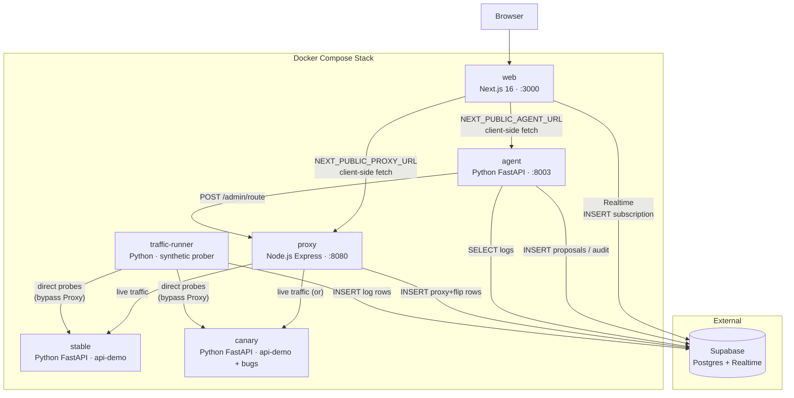
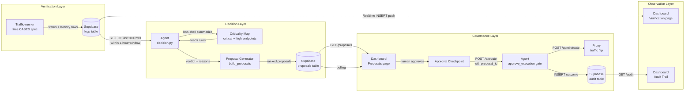
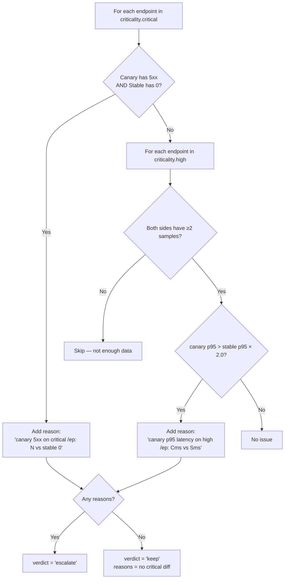
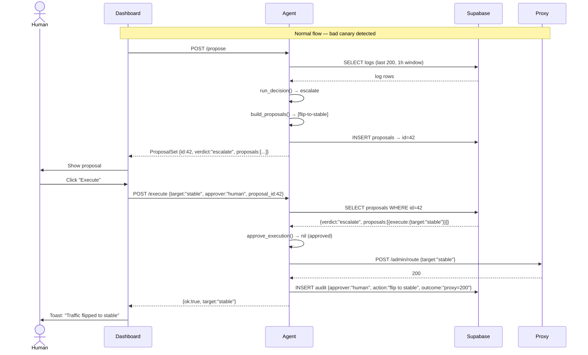
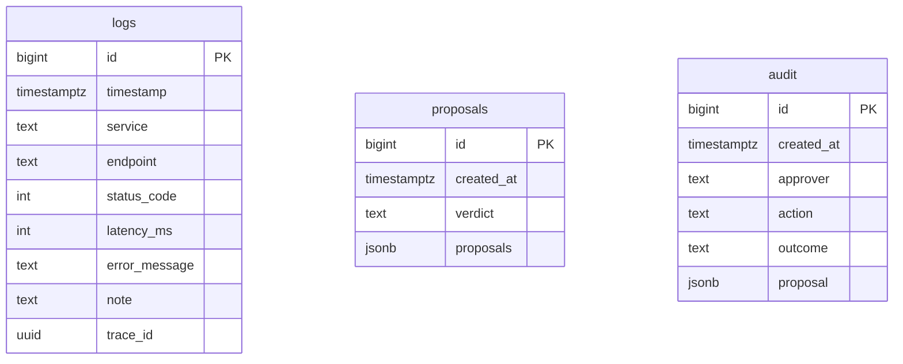

# GuardRail — Track A Presentation

> **Canary deployment verifier with governance-gated remediation**
> IBM Hackathon · Track A

---

## 1. Executive Summary

GuardRail is a full-stack, containerised system that automates the hardest part of canary deployments: deciding whether a new version is safe **and then safely acting on that decision**. It fires identical synthetic probes at both Stable and Canary simultaneously, computes a data-driven verdict, ranks remediation options by risk, and gates any traffic flip behind a human approval step — with every decision recorded in an immutable audit trail. The result is a system where "promote" and "rollback" are never panic buttons; they are governed, traceable actions.

---

## 2. The Problem

Canary deployments are standard practice, but two failure modes keep recurring:

| Failure mode | Root cause |
|---|---|
| Bad canary gets promoted | No automated comparison — human eyeballs miss regressions |
| Good canary gets killed | Panic rollback with no data — "it looked slow" |
| Rollbacks leave no trace | Who flipped what, why, and when? No one knows |
| Criticality is implicit | All endpoints treated the same; `/checkout` failures buried next to `/favicon.ico` noise |

GuardRail solves all four with a single, observable pipeline.

---

## 3. System Architecture

Six Docker services, one external dependency (Supabase):



### Key architectural decisions

- **Traffic-runner bypasses the Proxy.** It probes Stable and Canary directly so measurements are never contaminated by in-flight traffic split or proxy overhead. This is deliberate — the Proxy's job is routing live traffic, not measurement.
- **Supabase is the single message bus.** All services write to one Postgres instance. The dashboard reads from the same tables in real-time over WebSockets — no polling loop, no separate message broker.
- **Agent is stateless.** Every `/decide` call re-reads from Supabase. No in-memory state means the agent can be restarted at any time without losing context.
- **Proxy is the sole flip mechanism.** No service can change routing except by calling `POST /admin/route` on the Proxy. This single chokepoint makes the audit trail complete.

---

## 4. End-to-End Data Flow



---

## 5. Service Deep-Dives

### 5.1 `api-demo` — Stable & Canary (Python FastAPI)

Both Stable and Canary are the **same Docker image** (`services/api-demo`), differentiated only by the `BUG_PROFILE` environment variable. This proves the system works against real code differences — not mocks.

**Planted bugs in Canary** (`bugs.py`):

| Endpoint | Stable behaviour | Canary behaviour | Tier |
|---|---|---|---|
| `GET /search?q=*` | Responds in ~0ms | **800ms artificial delay** | high |
| `POST /checkout {}` | Returns `400` (validation error) | **Returns `500`** (crashes) | critical |
| `POST /checkout {valid}` | Returns `200 ok` | Returns `200 ok` (no regression) | critical |

The edge case (`POST /checkout {}`) is the key demo moment: an empty body is a valid input that Stable handles gracefully with a `400`; Canary panics with a `500`. The Decision engine catches this immediately.

### 5.2 `proxy` — Traffic Router (Node.js / Express)

The Proxy has two concerns:

1. **Routing** — forwards all live traffic to whichever target (`stable` | `canary`) is currently active, using `http-proxy-middleware`.
2. **Logging** — records every proxied request as a `proxy->stable` or `proxy->canary` log row in Supabase. Traffic flip events are recorded as `proxy` service rows with a `note` field (not `error_message`).

```
GET  /health        → { ok: true, target: "stable" }
GET  /admin/route   → { target: "stable" }
POST /admin/route   → { target: "canary" }   ← the only flip mechanism
```

Logging **never blocks proxying** — all Supabase writes are fire-and-forget with swallowed exceptions.

### 5.3 `traffic-runner` — Synthetic Verifier (Python / httpx)

The Traffic-runner fires the **canonical CASES spec** (`workers/shared/verification.py`) at both services simultaneously and writes the results to Supabase. It has no opinion about what the results mean — it is a pure measurement tool.

**CASES fired every run:**

```python
CASES = [
    ("GET",  "/search?q=normal", None),          # high tier baseline
    ("GET",  "/search?q=edge",   None),          # high tier edge
    ("POST", "/checkout", {"item_id": "a", "qty": 1}),  # critical happy path
    ("POST", "/checkout", {}),                   # critical edge → triggers canary bug
]
```

Each case is fired at both Stable and Canary, producing 8 log rows per run. In `RUN_ONCE=true` mode (set in docker-compose), it fires once and exits — this is the demo mode. In continuous mode it loops every `INTERVAL_SECONDS`.

### 5.4 `agent` — Decision Engine (Python FastAPI)

The Agent is the intelligence layer. It is a clean layered architecture with strict separation:

```
graph.py       ← HTTP adapter (FastAPI routes, thin wiring only)
service.py     ← Orchestration (fetch → window → decide → propose → persist)
decision.py    ← Pure Decision logic (no I/O — fully unit-testable)
criticality.py ← IBM Bob integration (bob-shell with fallback)
proxy.py       ← Proxy adapter (flip via HTTP)
store.py       ← Supabase I/O adapters
schemas.py     ← Pydantic HTTP contract shapes
settings.py    ← Env validation (fails fast at startup)
```

**API endpoints:**

| Method | Path | Purpose |
|---|---|---|
| `GET` | `/health` | Liveness probe |
| `POST` | `/decide` | Run Decision, return verdict + reasons (no persist) |
| `POST` | `/propose` | Run Decision + Proposals + persist to Supabase |
| `GET` | `/proposals` | List recent proposal sets (newest first) |
| `GET` | `/audit` | List recent execution records |
| `POST` | `/execute` | Approval gate → Proxy flip → Audit record |

### 5.5 `web` — Dashboard (Next.js 16 / React 19)

Four pages, each backed by typed API hooks:

| Page | Route | Data source | Key interaction |
|---|---|---|---|
| Overview | `/` | Agent `/proposals` + `/health`, Proxy `/admin/route` | Status at a glance |
| Verification | `/verification` | Supabase Realtime `logs` table | Live log stream, p95 + error-rate summary |
| Decision & Proposals | `/proposals` | Agent `/proposals` | Run Decision, approve & execute traffic flip |
| Audit Trail | `/audit` | Agent `/audit` | Append-only execution history |

**Technology choices in the frontend:**

| Concern | Choice | Reason |
|---|---|---|
| Data fetching | TanStack Query v5 | Cache deduplication, background refetch, mutation states |
| Real-time logs | Supabase Realtime (WebSocket) | Zero-polling, push on INSERT |
| UI components | Base UI + shadcn/ui + Tailwind v4 | Unstyled primitives → full control, no theming fights |
| Type safety | TypeScript 5 + shared `guardrail.ts` types | Single source of truth for all API shapes |
| State | React 19 + React Compiler | No manual memoisation needed |

---

## 6. The Decision Algorithm

Implemented in `workers/agent/domain/decision.py` — **pure function, zero I/O, fully unit-tested**.

```
run_decision(rows, criticality_map, latency_factor=2.0) → (verdict, reasons)
```

**Input window:** last 200 log rows, filtered to the past 1 hour.

**Two rules, applied in order:**



**Proposal generation (`build_proposals`):**

| Verdict | Proposals returned |
|---|---|
| `keep` | `[]` — nothing to do |
| `escalate` (5xx) | `[flip-to-stable (executable, risk=0.1)]` |
| `escalate` (latency only) | `[flip-to-stable (executable), investigate note (informational)]` |

The `execute` field on a Proposal is either `{"target": "stable"}` or `null`. The dashboard only shows the Execute button for non-null proposals.

---

## 7. IBM Bob Integration

`criticality.py` integrates IBM Bob's `bob-shell` CLI to derive the criticality map from project documentation rather than hardcoding it:

```python
def bob_criticality(spec_dir="docs/spec"):
    try:
        out = subprocess.run(
            ["bob-shell", "summarize", spec_dir, "--format", "json"],
            capture_output=True, text=True, timeout=30,
        )
        if out.returncode == 0:
            return json.loads(out.stdout)
    except Exception:
        pass
    return {**SPEC_CRITICALITY, "source": "fallback"}
```

- **When Bob is available:** The criticality map is derived from the spec documents in `docs/spec/` — Bob reads the ADRs, domain docs, and endpoint specs to understand which endpoints are business-critical.
- **When Bob is unavailable:** The system falls back to the hardcoded `SPEC_CRITICALITY` from `workers/shared/verification.py` — the demo never blocks.
- **Why this matters:** The same Decision engine that works with hardcoded thresholds during development automatically upgrades to doc-aware criticality in a live environment, without any code change.

---

## 8. The Governance Model

The Approval Checkpoint is the heart of the governance design. No traffic flip can execute without passing through it.



**The gate (`approve_execution`) rejects if:**
- The `proposal_id` does not exist in Supabase
- The proposal's verdict is not `escalate`
- The requested `target` is not in the approved proposals list

This means a human cannot flip to an arbitrary target — they can only execute what the Decision module approved.

---

## 9. Shared Contracts Layer

`packages/contracts/` (TypeScript) and `workers/shared/` (Python) implement the **same domain types** in both languages. There is one source of truth per concept:

| Concept | TypeScript (`@guardrail/contracts`) | Python (`workers/shared/`) |
|---|---|---|
| Service names | `ServiceName` enum | `ServiceName` class |
| Log row shape | `LogRow` type + `makeLogRow()` | `make_log_row()` |
| Error threshold | `ERROR_THRESHOLD = 500` | `ERROR_THRESHOLD = 500` |
| Probe cases | N/A (dashboard only displays) | `CASES` in `verification.py` |
| Criticality map | N/A | `CRITICALITY` in `verification.py` |
| Latency factor | N/A | `LATENCY_DEGRADATION_FACTOR = 2.0` |

Both the Proxy (Node.js) and the Traffic-runner/Agent (Python) import from their respective shared package. No duplication, no drift.

---

## 10. Database Schema

Three tables in Supabase (Postgres), all with Row Level Security enabled:



**`logs.service` constraint** (migration 0002): only `stable`, `canary`, `proxy`, or `proxy->*` are valid — enforced at the DB level so no writer can smuggle in arbitrary strings.

**`logs.note`** (migration 0003): separates administrative annotations (traffic flip events) from error messages. A flip row has `note = "traffic flip to stable"`, `error_message = null`.

**RLS policies**: `SELECT` and `INSERT` open to all authenticated and anonymous callers. `UPDATE` and `DELETE` are never granted — the audit table is physically append-only by policy.

---

## 11. Technology Stack Summary

| Layer | Service | Language | Framework | Key deps |
|---|---|---|---|---|
| Frontend | `web` | TypeScript | Next.js 16, React 19 | TanStack Query, Supabase JS, Tailwind v4, Base UI |
| Agent API | `agent` | Python 3.12 | FastAPI, Pydantic v2 | httpx, supabase-py, pydantic-settings |
| Proxy | `proxy` | Node.js 22 | Express | http-proxy-middleware, @guardrail/contracts |
| API demo | `stable` / `canary` | Python 3.12 | FastAPI | asyncio (latency injection) |
| Verifier | `traffic-runner` | Python 3.12 | — | httpx, supabase-py |
| Database | — | SQL | Supabase (Postgres 15) | Realtime (WebSocket CDC), RLS |
| Container | all | — | Docker Compose | multi-stage builds, healthcheck chains |
| AI integration | `agent` | — | IBM Bob (`bob-shell`) | Criticality doc ingestion |

---

## 12. Key Numbers

| Parameter | Value | Where set |
|---|---|---|
| Log rows fetched per Decision | 200 | `store.py: RECENT_FETCH_LIMIT` |
| Recency window | 1 hour (3600s) | `decision.py: RECENT_WINDOW_SECONDS` |
| Min samples for latency rule | 2 per side per endpoint | `verification.py: MIN_SAMPLES` |
| Latency escalation threshold | canary p95 > 2× stable p95 | `verification.py: LATENCY_DEGRADATION_FACTOR` |
| Canary search latency injection | 800ms | `bugs.py: CANARY_SEARCH_LATENCY_SECONDS` |
| Initial Realtime log fetch | 200 rows | `use-logs.ts: INITIAL_LIMIT` |
| Max log rows in browser memory | 500 | `use-logs.ts: maxRows default` |
| Agent health poll interval | 15s | `use-agent-queries.ts` |
| Proxy route poll interval | 10s | `use-agent-queries.ts` |

---

## 13. How to Demo (Live)

1. **Bring up the stack:**
   ```bash
   docker compose up --build
   ```
   Wait for all healthchecks to pass. The traffic-runner fires once and exits (`RUN_ONCE=true`).

2. **Open the dashboard:** `http://localhost:3000`

3. **Verification page (`/verification`):**
   - The logs table already has 8 rows from the traffic-runner run.
   - The summary bar shows: Canary error rate > 0%, Canary p95 latency >> Stable p95.
   - Realtime: as more runs complete, rows appear without refreshing.

4. **Proposals page (`/proposals`):**
   - Click **Run Decision** — this calls `POST /propose`.
   - The agent reads the logs, detects the `/checkout` 500 and the `/search` latency regression.
   - A ProposalSet appears: verdict `escalate`, with proposal "traffic flip to stable".

5. **Execute the flip:**
   - Click **Execute** on the flip-to-stable proposal.
   - Toast: "Traffic flipped to stable".
   - The Overview page's Proxy Target card changes from Canary → Stable.

6. **Audit Trail (`/audit`):**
   - The flip is recorded: approver `dashboard`, action `flip to stable`, outcome `proxy=200`.
   - This record cannot be deleted or modified.

---

## 14. What Makes This Production-Ready

- **Fail-fast env validation** (`settings.py` — pydantic): container crashes on startup if any required env var is missing, rather than failing silently at runtime.
- **Logging never blocks traffic** (proxy `logger.js`): Supabase write failures are swallowed so a database hiccup cannot take the proxy down.
- **History reads never block Decisions** (`store.py`): `_list_recent` returns `[]` on any exception — a missing table cannot prevent the Decision from running.
- **Pure Decision logic** (`decision.py`): zero I/O, fully unit-tested in `test_decision.py`. The HTTP layer is a thin adapter over tested business logic.
- **Lazy Supabase singleton** (`supabase.ts`): deferred initialisation prevents Next.js build-time crashes when `NEXT_PUBLIC_SUPABASE_URL` is not set in CI.
- **Immutable audit trail**: RLS at the DB level — no `UPDATE`/`DELETE` grant exists, period.
- **Approval gate is cryptographic-free but integrity-protected**: the `approve_execution` gate cross-references the `proposal_id` against the persisted Supabase record — the frontend cannot forge an approval by sending an arbitrary target.
